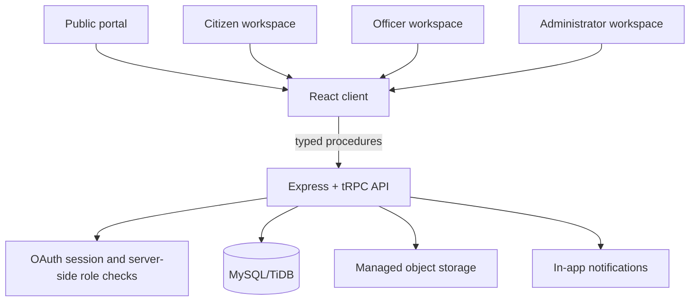

# CivicResolve Architecture

## Purpose

CivicResolve is a responsive civic-service portal for submitting, tracking, assigning, resolving, and reviewing grievances. It has a public entry experience alongside protected workspaces for citizens, departmental officers, and administrators. The application will use durable database records for every grievance action and will surface clear, accessible workflow feedback.

## Technology Stack

| Layer | Selection | Rationale |
|---|---|---|
| Frontend | React 19, Vite, Wouter, Tailwind CSS 4, and preinstalled accessible UI primitives | Provides a fast, responsive interface without adding unnecessary libraries. |
| Backend API | Node.js, Express, and tRPC | Gives the frontend typed procedure contracts and centralizes validation and authorization. |
| Database | MySQL/TiDB through Drizzle ORM | The managed project database is relational, supports foreign-key relationships, and fits the workflow-oriented data model. |
| Authentication | Managed OAuth session with secure HTTP-only cookie | The project template already provides a secure session flow; the application will enforce all roles on the server. |
| Validation | Zod | Validates all incoming server procedure inputs and complements client form guidance. |
| Files | Managed object storage with attachment metadata in the database | Keeps document bytes outside the relational database while retaining secure grievance-level references. |
| Notifications | Persistent in-app notification records | Meets the notification requirement without introducing an unnecessary realtime or email-delivery service. |

## System Architecture

The frontend will never decide authorization on its own. It will display routes based on the authenticated role for usability, while each protected procedure will independently verify the stored role and ownership constraints. Grievance transitions will be checked by a single server-side workflow rule set before records, status history, and notifications are written.

## Roles and Controlled Workflow

| Role | Main permissions | Explicit restrictions |
|---|---|---|
| Citizen | Submit and view only their own grievances; review history; add feedback after resolution; request a permitted reopen or escalation. | Cannot access other users’ cases or make staff assignments. |
| Officer | View cases assigned to them; process cases; create progress updates; change permitted statuses and priorities; resolve cases. | Cannot browse every grievance or manage users, departments, or categories. |
| Administrator | View all cases; assign or reassign officers; manage departments/categories/officer records; review metrics and workload. | Administrative controls are available only to the administrator role. |

Allowed status transitions are deliberately constrained: **Submitted → Acknowledged → Assigned → In Progress → Resolved → Closed**. An officer or administrator can escalate an active case to **Escalated**, then resume work in **In Progress**. A citizen can request a permitted **Resolved → Reopened → In Progress** flow. Every valid state change creates an immutable history item; invalid status changes fail with a safe, understandable message.

## Modules and Page Map

| Area | Pages and responsibilities |
|---|---|
| Public | `/` service overview, public ticket lookup, how-it-works guidance, and clear sign-in/submission calls to action. |
| Citizen | `/dashboard`, `/grievances`, `/grievances/new`, `/grievances/:id`, and `/profile` for personal submission, tracking, feedback, and profile overview. |
| Officer | `/officer/dashboard`, `/officer/grievances`, and `/officer/grievances/:id` for assigned queue management, case processing, and workload context. |
| Administrator | `/admin/dashboard`, `/admin/grievances`, `/admin/officers`, `/admin/departments`, and `/admin/categories` for system management and analytics. |

## Data Model

| Entity | Core purpose and relationships |
|---|---|
| User | Authenticated identity with a citizen, officer, or administrator role. A citizen owns grievances; an officer has one profile. |
| Department | Active service department. It has categories, officers, and grievances. |
| GrievanceCategory | Department-specific, active category selected during grievance submission. |
| OfficerProfile | Maps an officer user to a department and optional designation or availability data. |
| Grievance | Central case record with unique tracking number, citizen, category, department, assignee, title, description, location, priority, status, and lifecycle timestamps. |
| GrievanceHistory | Immutable actor-attributed status and activity timeline for a grievance. |
| Attachment | File key, public storage path, type, size, and uploader metadata; it belongs to one grievance. |
| Feedback | One post-resolution citizen feedback item for a grievance. |
| Notification | In-app notification record linking a user to a grievance event and read state. |

## API Surface

The typed backend will expose feature namespaces rather than redundant REST endpoints. The important contracts are `public.lookup`, `catalog.departments`, `catalog.categories`, `grievances.create`, `grievances.listMine`, `grievances.getById`, `grievances.listAssigned`, `grievances.updateWorkflow`, `grievances.assign`, `admin.dashboard`, `admin.listGrievances`, `admin.manageDepartments`, `admin.manageCategories`, `admin.manageOfficers`, `feedback.submit`, and `notifications.list`. Each contract validates its inputs and returns only fields appropriate to the caller.

## Design Direction

The visual system follows a minimalist Scandinavian civic-service tone: pale cool-gray backgrounds, ink-black typography, thin quiet supporting labels, generous whitespace, narrow dividers, rounded-but-restraint-driven cards, and soft pastel blue/blush geometric accents. Public-facing pages use an editorial layout with intentional negative space, while the authenticated areas use responsive dashboard patterns, readable tables, status badges, and an accessible timeline. This approach keeps the experience calm and trustworthy while preserving scanability for operational work.

## Implementation Phases

| Phase | Outcome | Verification focus |
|---|---|---|
| Foundation | Data model, typed procedures, role helpers, and workflow rule set. | Schema migration, authorization tests, and type checks. |
| Citizen journey | Public home, lookup, personal dashboard, grievance submission, timeline, and feedback. | Validation, persistence, ownership boundaries, and mobile forms. |
| Staff workflows | Officer queue/case processing and administrator monitoring/management. | Assignment, filtering, transitions, metrics, and access control. |
| Finishing | Notification records, responsive polish, accessibility feedback, tests, and visual review. | Desktop/mobile previews, console review, and Vitest. |

## Important Assumptions

The managed OAuth identity represents sign-in and registration, so the project will not duplicate password registration or password storage. It will extend the managed role field to support **officer** while retaining server-side role authorization. Supporting uploads will initially accept safe document/image types and retain metadata in the database. Notifications will be in-app and persistent, rather than external email, to keep the application demonstrable and its delivery scope reliable. A compact development seed path will provide non-production project records only when explicitly executed, never as a substitution for real runtime persistence.
