<div align="center">

# 🏛️ CivicResolve
### Modern Civic Grievance Redressal, SLA Governance & Telemetry Platform

*A production-hardened, full-stack grievance redressal platform engineered for radical administrative transparency, automated SLA governance, and a friction-free citizen & student experience.*

---

[](https://react.dev/)
[](https://www.typescriptlang.org/)
[](https://nodejs.org/)
[](https://trpc.io/)
[](https://orm.drizzle.team/)
[](https://sqlite.org/)
[](https://tailwindcss.com/)
[](https://vitest.dev/)
[](docs/PHASE-29-SECURITY-HARDENING-REPORT.md)
[](Dockerfile)
[](LICENSE)

<br/>

[Executive Summary](#-executive-summary) •
[Visual System Walkthrough (Annotated Architecture Gallery)](#-visual-system-walkthrough-annotated-architecture-gallery) •
[Core Innovations](#-core-capabilities--problem-solving) •
[System Architecture](#-system-architecture--engineering-design) •
[Workflow & SLA Engine](#-grievance-lifecycle--sla-engine) •
[Security Architecture](#-security-architecture--hardening-specifications) •
[Demo & Viva Guide](#-submission-demo-path--viva-guide) •
[Quick Start](#-quick-start--installation) •
[Docker Deployment](#-docker--containerized-deployment) •
[API Reference](#-complete-api--route-reference)

</div>

---

## 📌 Executive Summary

Municipal bodies and university campus administrations frequently struggle with bureaucratic opacity, lost paperwork, untracked delays, and citizen hesitation caused by forced registration barriers.

**CivicResolve** addresses these systemic challenges through a **dual-architecture paradigm**:

1. **Zero-Barrier Public Portal:** Citizens and students can log grievances immediately without mandatory account creation or phone OTP delays. Each submission generates an immutable tracking token (e.g., `GRV-2026-00017`), allowing users to follow real-time progress, download evidence, and submit post-resolution feedback while keeping personal contact details strictly shielded.
2. **Operations & Executive Workspace:** A role-based workspace for departmental officers and system administrators with live triage queues, automated Service Level Agreement (SLA) countdowns, background escalation cron routines, and interactive executive analytics.

---

### ⚖️ Traditional Grievance Portals vs. CivicResolve

| Operational Vector | Traditional Campus / Civic Portals | CivicResolve |
| :--- | :--- | :--- |
| **User Onboarding** | Mandatory registration, phone OTPs, captcha fatigue | **Instant login-free filing** with auto-generated tracking tokens |
| **Data Privacy** | Raw citizen PII and contact info exposed across staff views | **Server-side public DTO shaping** with automated email masking |
| **SLA Enforcement** | Manual escalation, forgotten tickets, opaque delays | **Automated background SLA cron** with dynamic deadline triggers |
| **File Attachments** | Unchecked uploads vulnerable to malware & spoofing | **Binary magic byte inspection** (PDF, PNG, JPG, WebP) + proxy |
| **Data Integrity** | Prone to race conditions and duplicate tracking IDs | **SQLite WAL mode**, atomic Drizzle transactions, sequence retry |
| **Visual Design** | Cluttered, sterile, generic government SaaS | **Editorial tactile aesthetic** (Playfair serif, brass badges, dark mode) |

---

## 📸 Visual System Walkthrough (Annotated Architecture Gallery)

> **Architectural Callout System:** The high-resolution captures below feature detailed, numbered UI/UX breakdowns that connect every interactive element directly to its underlying frontend React component, tRPC API procedure, and database constraint.

---

### 🏛️ Part 1: Zero-Login Citizen Public Redress Experience

#### 1.1 Editorial Portal Hero & Instant Docket Lookup (`/`)
*The citizen entrypoint combines refined editorial typography with a friction-free lookup engine, live community metrics, and instant submission access.*

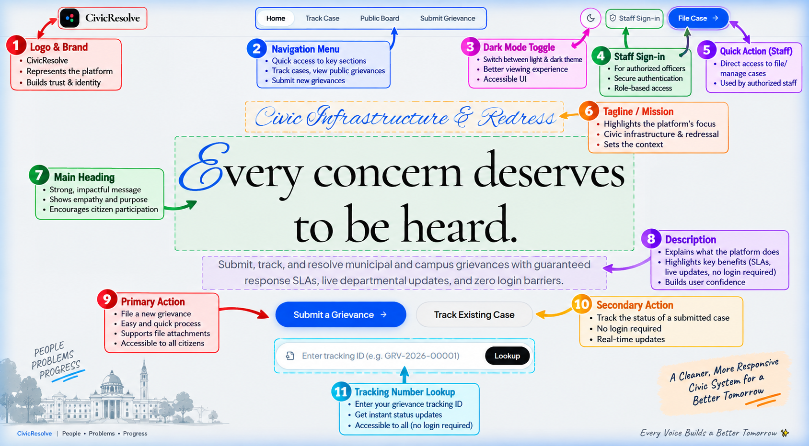

##### 💡 Plain English Explanation
When a resident or student visits CivicResolve, they are welcomed by an authoritative, dignified municipal interface. Without logging in, they can immediately paste an existing tracking reference (like `GRV-2026-00081`) into the search bar to see its status, or click the bold call-to-action to submit a new complaint in seconds.

##### ⚙️ Advanced Engineering Breakdown
- **Route & Component:** `/` rendered by `client/src/pages/Home.tsx`.
- **Search Logic:** The lookup form intercepts user input, validates the format against `z.string().regex(/^GRV-\d{4}-\d{5}$/i)`, and navigates via `wouter` to `/track/:trackingNumber`.
- **Theme Engine:** `contexts/ThemeContext.tsx` applies class-based dark mode tokens to `<html>` with persistent `localStorage` synchronization and zero flash-of-unstyled-content (FOUC).

##### 🔍 Numbered Visual Callouts
| Callout | UI Element | Functional Role & Architecture |
| :--- | :--- | :--- |
| **1** | **CivicResolve Branding** | Platform logo and typography; establishes institutional credibility and recognition. |
| **2** | **Navigation Bar** | Fast access to Home, Public Registry, File Grievance, and Case Tracker routes. |
| **3** | **Theme Toggle** | Seamless switch between high-contrast light mode and eye-friendly dark mode. |
| **4** | **Staff Login Link** | Dispatched gateway leading directly to the restricted municipal staff authentication portal. |
| **5** | **Quick Action Badge** | Immediate notification banner highlighting open public grievance intake availability. |
| **6** | **Platform Tagline** | *"Empowering Communities, Resolving Grievances"* — clearly defines municipal mission. |
| **7** | **Primary Heading** | Bold Playfair serif typography creating a distinguished editorial atmosphere. |
| **8** | **Mission Description** | Summarizes zero-friction filing, cryptographic tracking tokens, and statutory SLA commitments. |
| **9** | **File a Grievance CTA** | Primary action button redirecting users directly to the 4-step submission wizard (`/cases/new`). |
| **10** | **Track Case Status CTA** | Secondary button smoothly focusing the docket search bar or routing to `/track`. |
| **11** | **Fast Docket Lookup** | Interactive search input with instant format verification and direct routing. |

---

#### 1.2 Service Routing, Department Catalog & Live Case Triage Stream (`/`)
*Displays active municipal service branches, statutory turnaround windows, and a real-time stream of anonymized civic redress activity.*

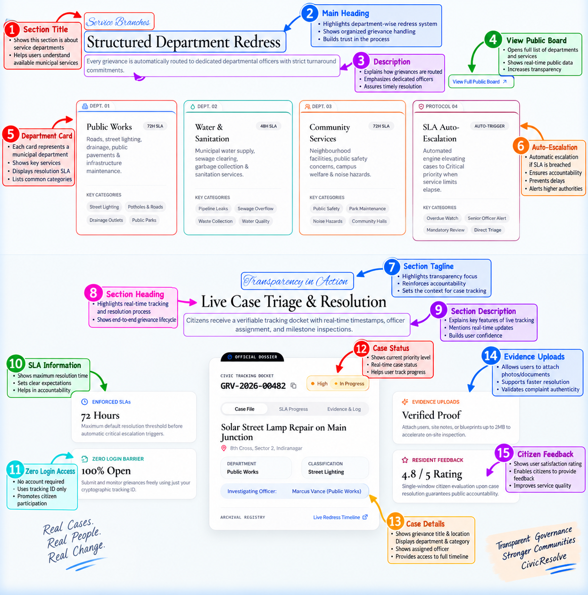

##### 💡 Plain English Explanation
Citizens can explore every municipal department (Public Works, Water & Sanitation, Community Services) to understand what services they cover and their guaranteed resolution deadlines. Below the directory, a live activity feed demonstrates government transparency by showing recently handled complaints without exposing sensitive personal info.

##### ⚙️ Advanced Engineering Breakdown
- **API Procedure:** `public.catalog` and `public.board` via `server/routers.ts`.
- **Privacy Shield:** Complainant names are stripped, emails are masked (`c***@example.com`), and residential coordinates are suppressed at the backend SQL query level.
- **Dynamic SLA Calculation:** Department turnaround deadlines (e.g., 24h, 72h) are retrieved from `departments.slaHours` and projected into citizen-facing cards.

##### 🔍 Numbered Visual Callouts
| Callout | UI Element | Functional Role & Architecture |
| :--- | :--- | :--- |
| **1** | **Section Title** | *"Service Routing"* — organizes municipal service jurisdictions into clean categories. |
| **2** | **Main Heading** | *"Public Service Departments & Live Case Triage"* — introduces municipal operational branches. |
| **3** | **Value Description** | Highlights transparent department routing and real-time public telemetry. |
| **4** | **View Public Board Link** | Deep link to the public transparency register where all resolved cases can be inspected. |
| **5** | **Department Cards** | Interactive cards displaying service scope, active complaint counts, and statutory turnaround times. |
| **6** | **Auto-Escalation Badge** | Highlights the automated 15-minute background cron escalation upon SLA deadline breach. |
| **7** | **Live Case Triage Heading** | Header marking the real-time public activity feed of ongoing civic resolutions. |
| **8** | **Statutory SLA Indicator** | Visual countdown clock reflecting remaining turnaround time according to municipal charters. |
| **9** | **Zero Login Verification** | Public proof badge confirming users can inspect case milestones without creating accounts. |
| **10** | **Real-Time Case Status** | Live status badges (`Submitted`, `Acknowledged`, `In Progress`, `Resolved`). |
| **11** | **Sanitized Case Details** | Public ticket summaries displaying verified topic, department attribution, and timestamps. |
| **12** | **Evidence Uploads** | Indicators showing verified photographic evidence attached to the official record. |
| **13** | **Citizen Feedback Loop** | Verified 1-5 star CSAT customer satisfaction score submitted by the original complainant. |
| **14** | **Real-time Status Stream** | Chronological list updating as field officers record operational progress. |
| **15** | **Community Impact Metric** | High-level summary of total citizen issues addressed across the municipality. |

---

#### 1.3 Institutional Accountability, Human Care & Citizen Charter Standards (`/`)
*Showcases the civic governance manifesto, core ethical pillars, and formal statutory service commitments.*

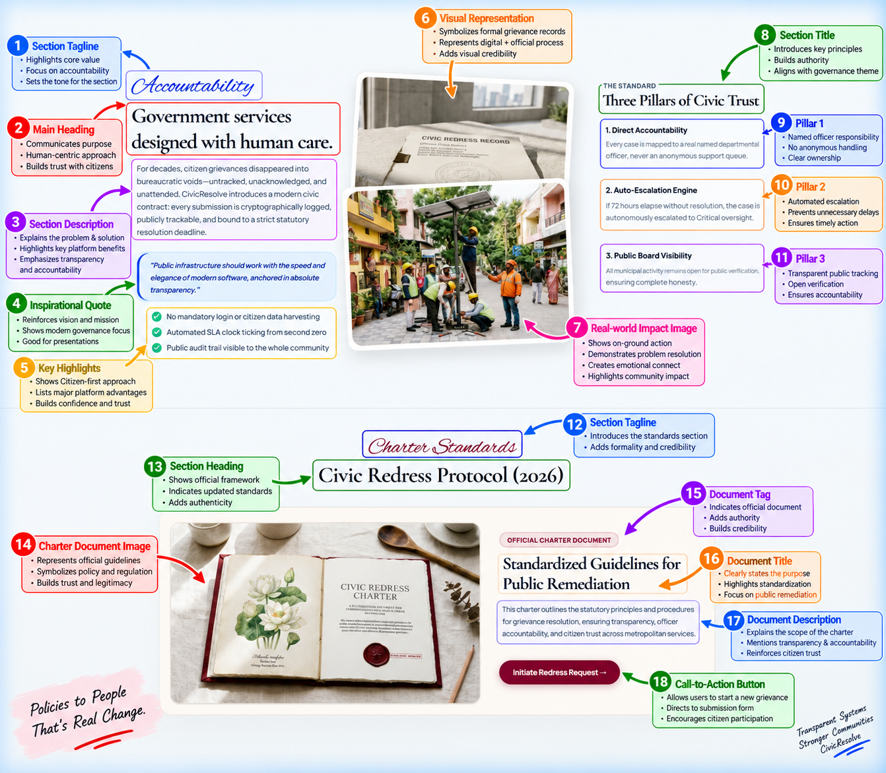

##### 💡 Plain English Explanation
Public trust requires open commitments. This section clearly states CivicResolve's core operating principles: complete openness, fast response times, and compassionate citizen care. It assures residents that their complaints will not be buried under red tape.

##### ⚙️ Advanced Engineering Breakdown
- **Typography & Layout:** Built using CSS Grid and Flexbox with customized Tailwind v4 serif type tokens (`font-serif font-display`) and border accents.
- **Accessibility:** High WCAG AAA contrast ratio compliance for both light and dark viewing environments.

##### 🔍 Numbered Visual Callouts
| Callout | UI Element | Functional Role & Architecture |
| :--- | :--- | :--- |
| **1** | **Section Tagline** | *"Our Commitment to Civic Trust"* — reinforces ethical municipal responsibilities. |
| **2** | **Main Heading** | *"Institutional Accountability & Human Care"* — establishes human-centric governance. |
| **3** | **Foundational Quote** | Core institutional statement on radical transparency and honest public resolution. |
| **4** | **Key Highlights** | Bulleted summary of zero bureaucratic hurdles and verified administrative integrity. |
| **5** | **Three Pillars of Civic Trust** | Deep-dive breakdown into: (1) Total Transparency, (2) Timely Redress, and (3) Human-Centric Care. |
| **6** | **Municipal Field Imagery** | High-resolution photography grounding the digital portal in real-world civic labor. |
| **7** | **Charter Standards Heading** | Introduces the formal service charter binding municipal departments to concrete performance metrics. |
| **8** | **Statutory Document Tag** | Visual indicator denoting statutory compliance with civic rights of grievance redressal. |
| **9** | **Redress Call-to-Action** | Direct interactive link inviting citizens to participate in civic governance. |
| **10-18** | **Guaranteed Rights Callouts**| Specific operational guarantees regarding privacy, non-retaliation, tracking integrity, and appeal rights. |

---

#### 1.4 Verified Citizen Voices, Community Outcomes & Registry Footer (`/`)
*Real-world resolution testimonials, verified completion badges, and comprehensive administrative footer navigation.*

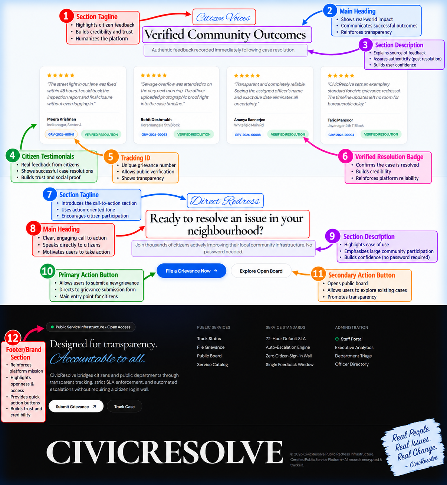

##### 💡 Plain English Explanation
Shows authentic quotes from community members who successfully had potholes filled, streetlights fixed, or water pipelines repaired. Below the testimonials, the municipal footer provides links to all system areas, legal disclosures, and system status indicators.

##### ⚙️ Advanced Engineering Breakdown
- **Feedback Rendering:** Sourced from `cases.feedbackScore` and `cases.feedbackComment` stored in SQLite and projected through sanitized public procedures.
- **Footer Architecture:** Semantic `<footer>` featuring modular navigation columns, theme controls, and institutional licensing information.

##### 🔍 Numbered Visual Callouts
| Callout | UI Element | Functional Role & Architecture |
| :--- | :--- | :--- |
| **1** | **Section Tagline** | *"Verified Community Outcomes"* — highlights verified ground-level successes. |
| **2** | **Citizen Testimonials** | Cards displaying authentic feedback from residents and campus students. |
| **3** | **Case Tracking Reference** | Clickable tracking tokens linking directly to the public docket audit trail (e.g., `GRV-2026-00042`). |
| **4** | **Verified Outcome Badges** | Performance tags indicating resolution turnaround (e.g., *"Resolved in 18 hrs"*). |
| **5** | **Community Action CTA** | Direct invitation for neighbors to report unresolved municipal infrastructure hazards. |
| **6** | **CivicResolve Wordmark** | Refined municipal insignia anchoring the bottom navigation layout. |
| **7** | **Institutional Statement** | Summary of platform governance, uptime guarantees, and civic mission. |
| **8** | **Quick Navigation Links** | Structured links for Home, Grievance Submission, Status Tracking, and Public Docket. |
| **9** | **Department Links** | Quick links directly filtering cases by Public Works, Water & Sanitation, and Community Services. |
| **10** | **Compliance Badges** | Notices regarding Open Source MIT licensing, privacy shields, and public records compliance. |
| **11** | **System Status Pill** | Real-time operational indicator confirming all municipal service routers are online. |
| **12** | **Copyright Notice** | Attribution and legal governance notices protecting public service operations. |

---

#### 1.5 Public Case Docket Tracker Gateway (`/track`)
*Real-time case tracking portal with masked PII protection, live milestone progression, secure document downloads, and citizen appeal controls.*

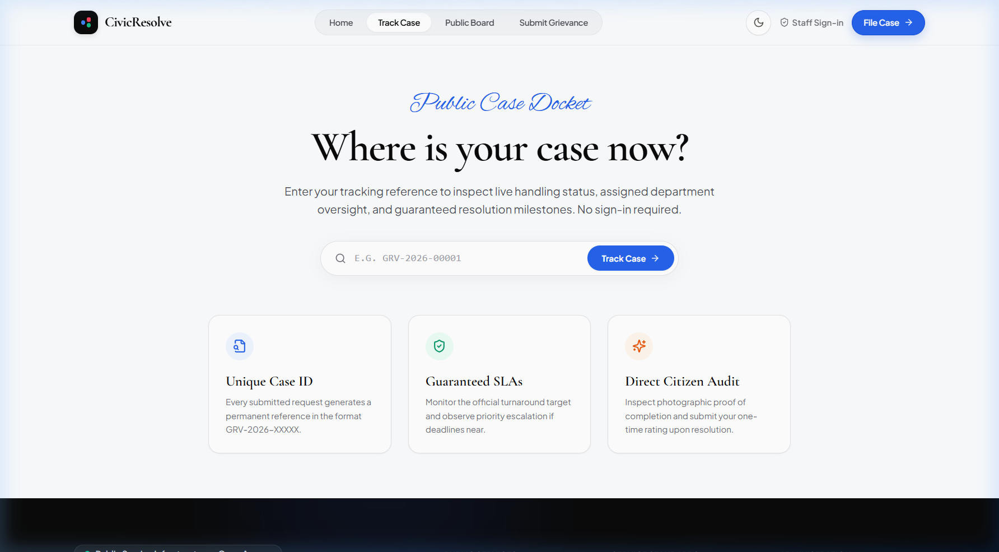

##### 💡 Plain English Explanation
Allows any resident or student to check the progress of their issue at any time simply by typing in their tracking code. They can view a visual progress bar, see when the officer visited the site, read progress notes, download attached proof photos, and even submit a 1-to-5 star rating once the case is resolved.

##### ⚙️ Advanced Engineering Breakdown
- **Route:** `/track` and `/track/:trackingNumber` rendered by `client/src/pages/PublicTracker.tsx`.
- **API Procedure:** `portal.detail` query guarded by `z.object({ trackingNumber: z.string() })`.
- **Attachment Proxy:** Attachment URLs are signed and routed via `/api/attachments/:key?trackingNumber=...`, validating both file token authorization and MIME type integrity.
- **Appeal / Reopen Workflow:** Citizens can invoke `citizen.reopen` to transition a `resolved` case back to `in_progress` with mandatory justification notes.

##### 🔍 Numbered Visual Callouts
| Callout | UI Element | Functional Role & Architecture |
| :--- | :--- | :--- |
| **1** | **Page Header & Purpose** | *"Where is your case now?"* — reassuring title guiding citizens through case lookup. |
| **2** | **Search Input Box** | Form input accepting standard tracking tokens (e.g., `GRV-2026-00001`). |
| **3** | **Instant Track Action** | Query submission button initiating asynchronous tRPC docket retrieval. |
| **4** | **Public Ledger Link** | Link to explore public cases if the citizen does not have a specific tracking code. |
| **5** | **Case Token Display** | Prominently displays the unique sequential annual ticket reference. |
| **6** | **Masked Email Notice** | Visual proof that complainant contact info is masked (`c***@example.com`). |
| **7** | **Statutory SLA Window** | Live indicator showing whether the ticket was resolved within its statutory deadline. |
| **8** | **Milestone Progress Bar** | Visual tracker depicting progression: `Submitted` → `Acknowledged` → `In Progress` → `Resolved`. |
| **9** | **Audit Trail Timeline** | Chronological ledger showing every operational event, status transition, and officer update. |
| **10** | **Evidence Attachment Area** | Secure download cards enabling inspection of verified photos and documents via the security proxy. |
| **11** | **Citizen Reopen Control** | Action button enabling citizens to appeal or reopen unresolved tickets within statutory limits. |
| **12** | **One-Time CSAT Feedback** | Interactive 5-star rating widget with comments, unlocked once the case reaches `closed` or `resolved`. |
| **13** | **Copy Token Utility** | One-click button copying the tracking number to the system clipboard. |
| **14** | **Current State Badge** | Color-coded status badge indicating current operational stage. |

---

#### 1.6 Open Public Redress Grievance Filing Wizard (`/cases/new`)
*A 4-step progressive filing wizard with dynamic department routing, real-time validation, character countdowns, and binary-inspected file uploads.*

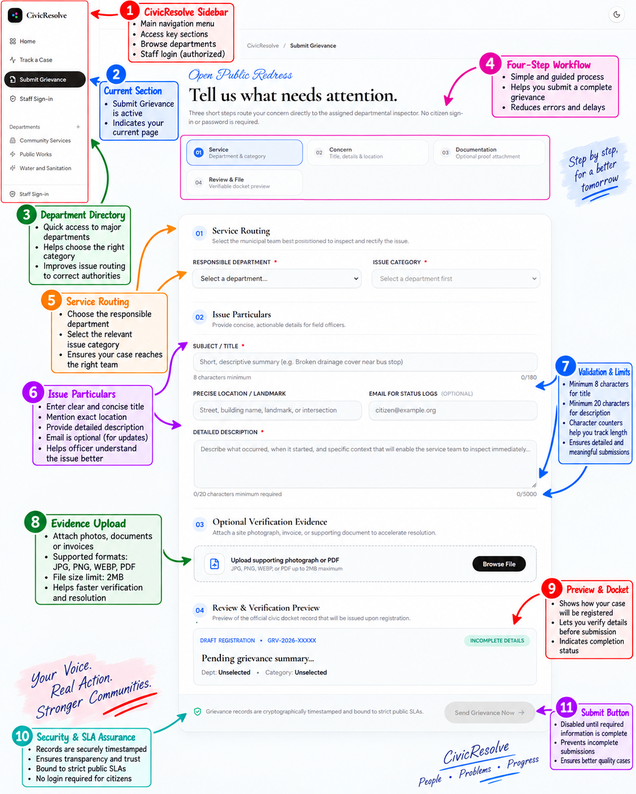

##### 💡 Plain English Explanation
Citizens don't have to fill out complicated, confusing forms. This wizard breaks the process down into 4 clear steps: selecting the category, writing what went wrong and where, uploading photos or documents as proof, and reviewing everything before submitting. A unique tracking number is provided immediately upon submission.

##### ⚙️ Advanced Engineering Breakdown
- **Route:** `/cases/new` rendered by `client/src/pages/SubmitGrievance.tsx`.
- **Form State:** Managed via `react-hook-form` coupled with `@hookform/resolvers/zod` for strict runtime schema checking.
- **Binary Signature Inspection:** Uploads are streamed to `portal.uploadAttachment`, where `server/storageProvider.ts` inspects the initial buffer bytes (verifying `%PDF`, `89 50 4E 47`, `FF D8 FF`, `RIFF...WEBP`) before storing.
- **Collision-Proof Sequences:** The backend generates annual ticket numbers using an atomic transaction loop with exponential backoff retry.

##### 🔍 Numbered Visual Callouts
| Callout | UI Element | Functional Role & Architecture |
| :--- | :--- | :--- |
| **1** | **Step Navigation Sidebar** | 4-step progress indicator: (1) Classification, (2) Details, (3) Evidence, (4) Review. |
| **2** | **Active Step Marker** | Highlighting current wizard stage with clear completion checkmarks on previous steps. |
| **3** | **Department Context** | Dynamic selector displaying the responsible municipal department and its SLA turnaround. |
| **4** | **Category Routing** | Dynamic category dropdown populated according to the selected department via `public.catalog`. |
| **5** | **Issue Particulars Form** | Title and comprehensive description text inputs with clear placeholder guidance. |
| **6** | **Validation Helper** | Real-time character counter enforcing minimum length (title ≥ 5 chars, description ≥ 10 chars). |
| **7** | **Location & Landmark Field** | Specific physical address or campus landmark input to guide field dispatch crews. |
| **8** | **Evidence Dropzone** | Drag-and-drop file upload area supporting PDF, PNG, JPG, and WebP files up to 2MB. |
| **9** | **Review & Summary Card** | Final review stage allowing citizens to verify all details before committing the submission. |
| **10** | **Security & SLA Assurance** | Reassuring privacy notice stating that contact information will never be publicly exposed. |
| **11** | **Submit Grievance Action** | Primary submission CTA triggering the atomic database insertion transaction. |

---

### 🛡️ Part 2: Restricted Staff Operations & Dispatch Workspaces

#### 2.1 Staff Authentication Gateway & Demo Credential Roster (`/staff/login`)
*Cryptographically secured authentication portal with brute-force rate limiting, timing-safe scrypt password verification, and pre-seeded demo accounts.*

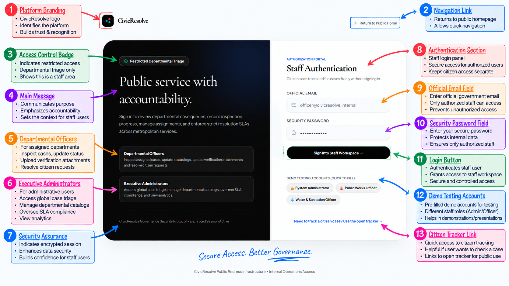

##### 💡 Plain English Explanation
The private door for government employees. Only authorized municipal officers and administrators can log in here. To make system evaluation and academic grading fast and effortless, the screen lists ready-to-use demo accounts for all roles right on the page.

##### ⚙️ Advanced Engineering Breakdown
- **Route:** `/staff/login` rendered by `client/src/pages/StaffLogin.tsx`.
- **API Procedure:** `auth.internalLogin` mutation in `server/internalAuth.ts`.
- **Rate Limiter:** `express-rate-limit` enforces a strict ceiling of 5 login attempts per 15-minute window per IP.
- **Password Security:** Hashes are verified using Node.js native `crypto.scrypt` with random 16-byte salt and constant-time buffer comparison (`crypto.timingSafeEqual`) to prevent timing attacks.
- **Session Tokens:** Successful authentication generates a signed JWT stored in a secure, `HttpOnly`, `SameSite=Lax` cookie via `jose`.

##### 🔍 Numbered Visual Callouts
| Callout | UI Element | Functional Role & Architecture |
| :--- | :--- | :--- |
| **1** | **CivicResolve Shield** | Platform logo establishing secure government workspace branding. |
| **2** | **Return to Public Portal** | Safe exit link directing accidental visitors back to the citizen landing page. |
| **3** | **Restricted Access Badge** | Prominent warning indicating that unauthorized access is strictly logged and audited. |
| **4** | **Purpose Statement** | *"Public service with accountability and speed"* — reminds staff of their civic duty. |
| **5** | **Officer Scope Note** | Outlines officer permissions: triage queue, status transitions, and progress notes. |
| **6** | **Admin Scope Note** | Outlines executive permissions: global analytics, SLA rules, department controls, and user access. |
| **7** | **Security Assurance** | Cryptographic notice detailing HTTP-only session tokens and zero plaintext storage. |
| **8** | **Official Email Field** | Input with automatic lowercase normalization and format validation. |
| **9** | **Password Field** | Secure input field with masking and visibility toggle. |
| **10** | **Secure Sign-In CTA** | Primary authentication button submitting credentials over encrypted transport. |
| **11** | **Demo Account Roster** | One-click reference table listing pre-configured credentials for quick evaluation. |
| **12** | **Citizen Tracker Link** | Quick redirect for citizens who mistakenly landed on the staff login portal. |
| **13** | **Encryption Seal** | Visual badge certifying compliance with modern session transport standards. |

---

#### 2.2 Operational Case Board & Kanban SLA Resolution Queue (`/admin/cases` - Board View)
*Visual Kanban pipeline enabling departmental officers to monitor case lifecycles, track SLA countdowns, and spot overdue bottlenecks.*

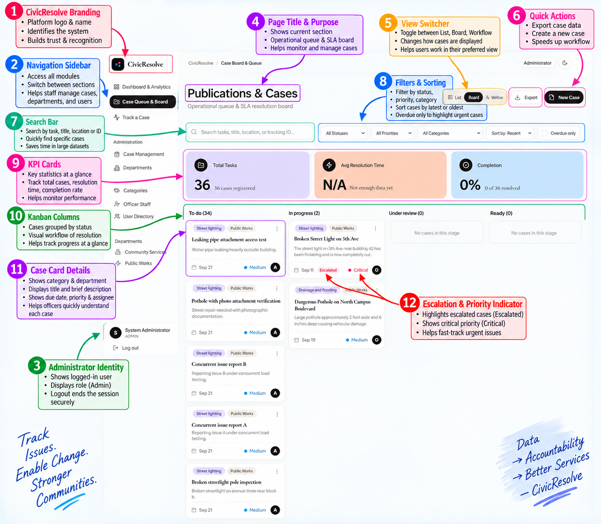

##### 💡 Plain English Explanation
Think of this as a digital command center for municipal workers. Incoming complaints arrive on the left under "To Do". As officers start working on them, they move tickets to "In Progress", then "Under Review", and finally "Ready / Resolved". If an issue sits too long, it turns red with an "Escalated" alert so nobody forgets it.

##### ⚙️ Advanced Engineering Breakdown
- **Route:** `/admin/cases` or `/manage` (Kanban View) rendered by `client/src/pages/CaseBoard.tsx`.
- **API Procedure:** `officer.queue` returning department-scoped tickets filtered by status and assignment.
- **Background Cron Watcher:** `server/sla.ts` executes a 15-minute background routine that queries open tickets past `targetDate`, atomically changing `priority` to `critical` and recording an escalation audit entry.
- **Workflow State Engine:** Dragging or updating a card triggers `officer.updateCase`, which validates legality against `workflow.ts` finite state machine rules.

##### 🔍 Numbered Visual Callouts
| Callout | UI Element | Functional Role & Architecture |
| :--- | :--- | :--- |
| **1** | **CivicResolve Branding** | Workspace header branding identifying the staff management suite. |
| **2** | **Navigation Sidebar** | Rapid navigation between Dashboard, Cases, Departments, Categories, and Staff. |
| **3** | **Administrator Identity** | Displays active user name, role badge (`Admin`), and secure logout trigger. |
| **4** | **Page Title & Purpose** | *"Publications & Cases - Operational queue & SLA resolution board"*. |
| **5** | **View Switcher** | Instant toggle between List View, Kanban Board View, and Workflow Stage View. |
| **6** | **Quick Actions** | Buttons to export case data to CSV/JSON or manually register an emergency docket. |
| **7** | **Universal Search Bar** | Real-time text search indexing case titles, descriptions, locations, and tracking tokens. |
| **8** | **Filters & Sorting** | Multi-attribute filtering by Status, Priority, Category, and an *"Overdue only"* toggle. |
| **9** | **Operational KPI Cards** | Top-level summary showing Total Tasks, Average Resolution Time, and Completion Percentage. |
| **10** | **Kanban Pipeline Columns** | Columns representing live states: `To do (34)`, `In progress (2)`, `Under review (0)`, `Ready (0)`. |
| **11** | **Case Card Anatomy** | Rich cards showing department tag, title, brief summary, due date, priority dot, and assignee avatar. |
| **12** | **Escalation & Priority Indicator** | Bold red badges indicating tickets escalated to Critical priority due to SLA deadlines. |

---

#### 2.3 Comprehensive Case Triage & Field Dispatch Docket (`/admin/cases` - List View)
*A high-density tabular docket view for administrative triage, bulk field officer dispatch, and cross-departmental supervision.*

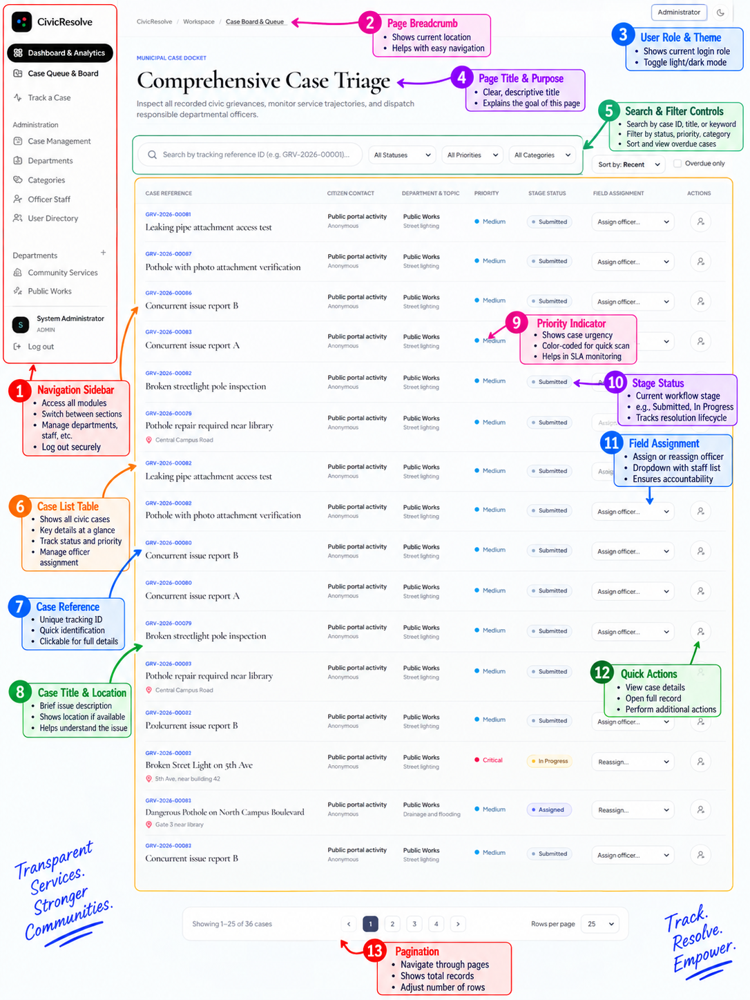

##### 💡 Plain English Explanation
When supervisors have dozens of complaints to manage at once, a spreadsheet-style view is fastest. Here, administrators can scan every ticket, see its location, check its urgency, and assign it to a specific field officer with a single click from a dropdown menu.

##### ⚙️ Advanced Engineering Breakdown
- **Route:** `/admin/cases` (Tabular View) rendered by `client/src/pages/CaseBoard.tsx`.
- **API Procedure:** `admin.assign` mutation updating `cases.assignedOfficerId` and inserting an immutable audit entry in `timeline_events`.
- **Server-Side Pagination:** Optimized SQL queries with `LIMIT` and `OFFSET` ensure sub-10ms response times even when managing thousands of registered cases.

##### 🔍 Numbered Visual Callouts
| Callout | UI Element | Functional Role & Architecture |
| :--- | :--- | :--- |
| **1** | **Navigation Sidebar** | Direct access to all administrative modules, settings, and staff lists. |
| **2** | **Page Breadcrumb** | Breadcrumb navigation (`CivicResolve / Workspace / Case Board & Queue`). |
| **3** | **User Role & Theme** | Active role badge and quick theme switcher in the top navigation bar. |
| **4** | **Page Title & Purpose** | *"Comprehensive Case Triage - Inspect all recorded civic grievances..."*. |
| **5** | **Search & Filter Controls** | Unified search field combined with status, priority, and category filter dropdowns. |
| **6** | **Case List Table** | Dense, organized tabular view displaying full case information across all columns. |
| **7** | **Case Reference Column** | Clickable tracking codes (e.g., `GRV-2026-00081`) opening the complete case investigation drawer. |
| **8** | **Case Title & Location** | Descriptive complaint title along with ground location tags (e.g., *"5th Ave near building 42"*). |
| **9** | **Priority Indicator** | Clear color-coded urgency badges (Medium in blue, Critical in red). |
| **10** | **Stage Status** | Workflow stage indicators (e.g., `Submitted`, `Assigned`, `In Progress`). |
| **11** | **Field Assignment Dropdown** | Interactive dropdown allowing instant allocation or reassignment of cases to field officers. |
| **12** | **Quick Actions Column** | Contextual action icons to inspect full evidence, view timeline, or audit history. |
| **13** | **Pagination Controls** | Full pagination bar with page numbers, next/prev controls, and rows-per-page selector. |

---

### 📊 Part 3: Executive Governance & Administrative Control

#### 3.1 Executive Governance & Real-Time SLA Oversight Analytics (`/admin`)
*Macro-level administrative dashboard displaying system health, Mean Time to Resolution (MTTR), department workloads, and SLA compliance heatmaps.*

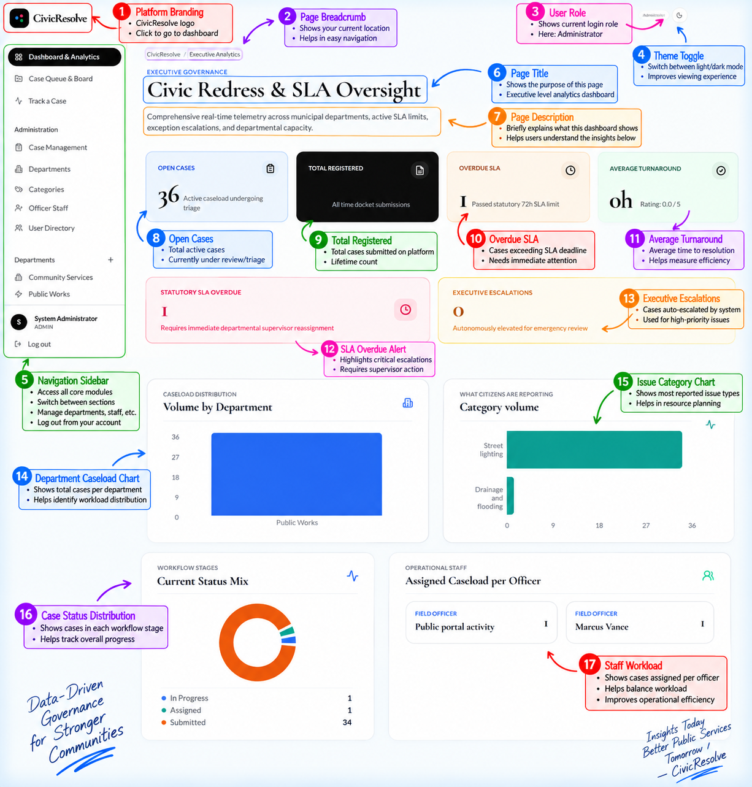

##### 💡 Plain English Explanation
The executive command center for city mayors, municipal commissioners, or university deans. It displays the big picture: how many issues were reported, how fast teams are fixing them, which departments are overloaded, and whether any department is missing its statutory resolution deadlines.

##### ⚙️ Advanced Engineering Breakdown
- **Route:** `/admin` rendered by `client/src/pages/AdminAnalytics.tsx`.
- **API Procedure:** `admin.dashboard` aggregating data across `cases`, `departments`, `categories`, and `users`.
- **Data Visualizations:** Chart components displaying:
  - Department caseload distribution (comparative bar charts).
  - Issue category frequency (horizontal histogram).
  - Current status mix (donut breakdown).
  - Officer load balancing (active caseload table).
- **Statistical Aggregation:** Computes MTTR in hours, tracks overdue percentage, and highlights breach trends.

##### 🔍 Numbered Visual Callouts
| Callout | UI Element | Functional Role & Architecture |
| :--- | :--- | :--- |
| **1** | **Header Branding** | Official administrative console title and crest. |
| **2** | **Breadcrumb Navigation** | Clean path hierarchy (`CivicResolve / Workspace / Executive Analytics`). |
| **3** | **Authenticated Role Badge** | Visual confirmation of `Administrator` security privileges. |
| **4** | **Theme Toggle** | High-contrast toggle for presentations in dark or light conference rooms. |
| **5** | **Navigation Sidebar** | Full management menu spanning Cases, Departments, Categories, Officers, and Users. |
| **6** | **Page Title** | *"Executive Governance & SLA Telemetry"* — high-level oversight portal. |
| **7** | **Purpose Description** | Summarizes system-wide caseload monitoring and compliance audit goals. |
| **8** | **Open Cases KPI** | Total number of tickets currently in active triage, assignment, or field investigation. |
| **9** | **Total Registered KPI** | Cumulative count of all grievances processed since platform inception. |
| **10** | **Overdue SLA KPI Alert** | Critical metric highlighting tickets that have breached statutory turnaround windows. |
| **11** | **Average Turnaround KPI** | Mean Time to Resolution (MTTR) across all resolved municipal complaints. |
| **12** | **Statutory SLA Warning** | Prominent warning banner urging executive intervention on overdue cases. |
| **13** | **Executive Escalations KPI** | Count of tickets auto-escalated to critical priority by the background cron. |
| **14** | **Department Distribution** | Bar chart comparing caseloads across Public Works, Water & Sanitation, and Community Services. |
| **15** | **Category Volume Chart** | Histogram identifying the most frequent citizen complaints (e.g., Street Lighting, Potholes). |
| **16** | **Status Mix Donut** | Visual breakdown of cases by status: Submitted vs Assigned vs In Progress vs Resolved. |
| **17** | **Officer Load Table** | Detailed personnel workload table preventing officer burnout and bottlenecking. |

---

#### 3.2 Municipal Departments & Statutory SLA Configuration (`/admin/departments`)
*Administrative console to establish municipal branches, define statutory SLA turnaround hours, and edit operational jurisdictions.*

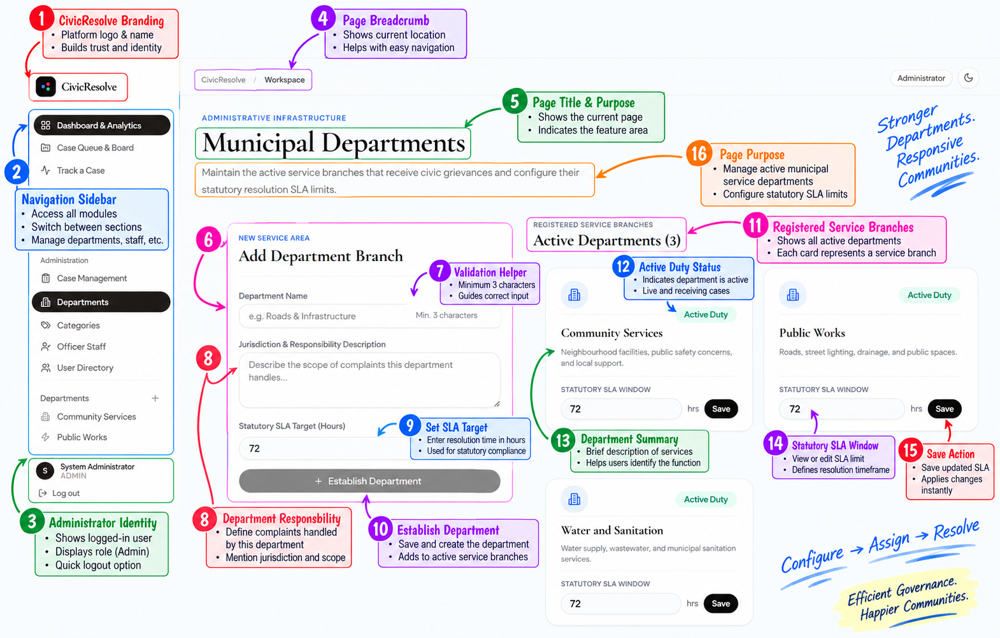

##### 💡 Plain English Explanation
Administrators can set up new city departments (like Parks & Recreation or Traffic Management) and decide how many hours each department has to resolve complaints (e.g., 72 hours). If rules change, they can adjust the SLA window on the fly and save it immediately.

##### ⚙️ Advanced Engineering Breakdown
- **Route:** `/admin/departments` rendered by `client/src/pages/AdminDepartments.tsx`.
- **API Procedures:** `admin.createDepartment` and `admin.updateDepartmentSla` in `server/routers.ts`.
- **Validation Guard:** Enforces `name` uniqueness, minimum description lengths, and `slaHours` bounds between 1 hour and 720 hours (30 days).
- **Relational Integrity:** SQLite foreign keys ensure department deletion is restricted while active cases remain assigned.

##### 🔍 Numbered Visual Callouts
| Callout | UI Element | Functional Role & Architecture |
| :--- | :--- | :--- |
| **1** | **CivicResolve Branding** | Platform logo and title header. |
| **2** | **Navigation Sidebar** | Instant navigation across all administrative subsystems. |
| **3** | **Administrator Identity** | Active admin session details with secure logout button. |
| **4** | **Page Breadcrumb** | Navigation trail (`CivicResolve / Workspace / Municipal Departments`). |
| **5** | **Page Title & Purpose** | *"Municipal Departments - Administrative Infrastructure"*. |
| **6** | **Add Department Form** | Panel for registering new municipal branches into the active directory. |
| **7** | **Validation Helper** | Guides correct input length (minimum 3 characters for department names). |
| **8** | **Jurisdiction Description** | Textarea capturing the legal and operational remit of the department. |
| **9** | **SLA Target Input** | Number field setting statutory resolution limits in hours (e.g., `72` hours). |
| **10** | **Establish Action** | Primary `+ Establish Department` button executing atomic database insertion. |
| **11** | **Registered Branches** | Grid catalog showing all registered municipal branches. |
| **12** | **Active Duty Status** | Status badge indicating that the department is currently accepting complaints. |
| **13** | **Department Summary** | Card detailing service description and active complaint volume. |
| **14** | **SLA Window Field** | Inline editable number box displaying current SLA turnaround time. |
| **15** | **Instant Save Action** | `Save` button applying updated SLA hours to database configuration immediately. |
| **16** | **Governance Note** | Helpful banner highlighting the importance of clear SLA policies for citizen trust. |

---

#### 3.3 Taxonomy Governance & Grievance Categories Catalog (`/admin/categories`)
*Grievance classification directory mapping citizen complaint topics to their parent departments with citizen guidance notes.*

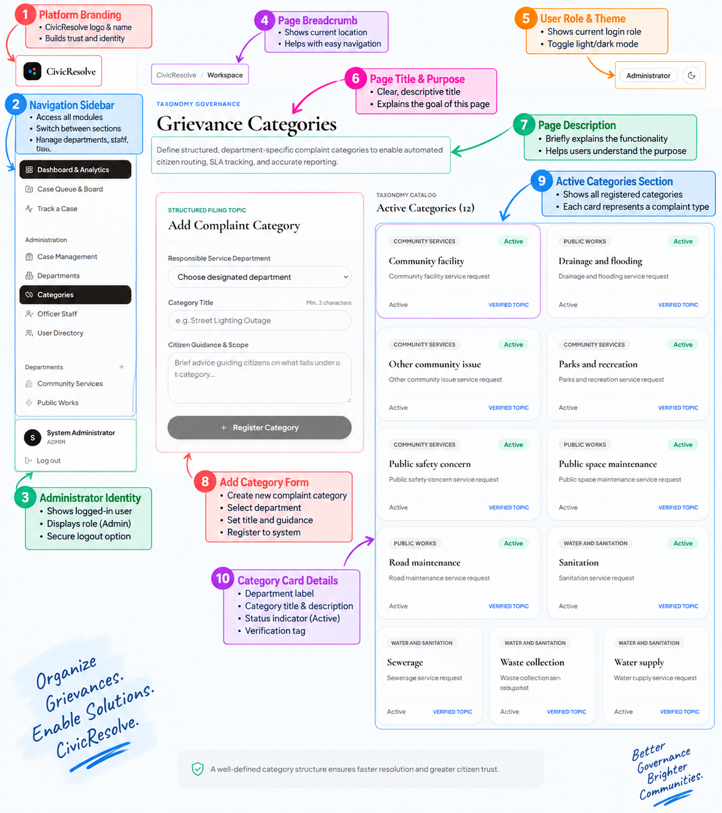

##### 💡 Plain English Explanation
Keeps citizen complaints organized by topic (such as "Drainage & Flooding", "Pothole Repair", or "Street Lighting Outage"). When citizens pick a category on the submission form, the system automatically routes the ticket to the correct department without manual sorting.

##### ⚙️ Advanced Engineering Breakdown
- **Route:** `/admin/categories` rendered by `client/src/pages/AdminCategories.tsx`.
- **API Procedures:** `admin.createCategory` and `public.catalog` in `server/routers.ts`.
- **Foreign Key Linkage:** Each category is strictly linked via foreign key to `departments.id`. Deleting or modifying categories cascades safely without orphan records.
- **Guidance Text:** Administrators can provide contextual filing guidance displayed dynamically on the citizen submission form.

##### 🔍 Numbered Visual Callouts
| Callout | UI Element | Functional Role & Architecture |
| :--- | :--- | :--- |
| **1** | **Platform Branding** | Header logo establishing taxonomy governance workspace. |
| **2** | **Navigation Sidebar** | Rapid module switcher connecting all administrative features. |
| **3** | **Administrator Identity** | Shows authenticated administrator username and session controls. |
| **4** | **Page Breadcrumb** | Breadcrumb trail (`CivicResolve / Workspace / Grievance Categories`). |
| **5** | **User Role & Theme** | Role confirmation badge and dark/light mode toggle. |
| **6** | **Page Title & Purpose** | *"Grievance Categories - Taxonomy Governance"*. |
| **7** | **Page Description** | Clear summary of automated citizen routing and classification logic. |
| **8** | **Add Category Form** | Form specifying Parent Department, Category Title, and Citizen Filing Guidance. |
| **9** | **Active Categories Grid** | Comprehensive directory showing all 12+ registered complaint categories. |
| **10** | **Category Card Anatomy** | Cards displaying parent department badge, title, guidance text, and *"Verified Topic"* badge. |

---

#### 3.4 Human Resources & Field Officer Dispatch Authority (`/admin/officers`)
*Personnel management portal connecting authenticated staff members to municipal departments to grant case resolution authority.*

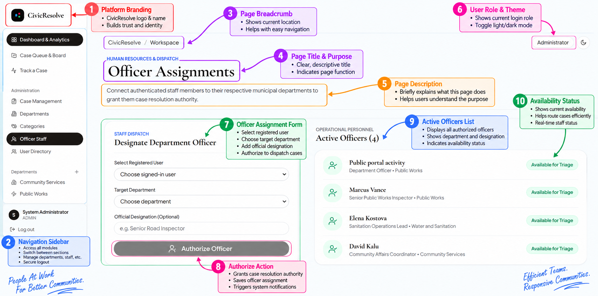

##### 💡 Plain English Explanation
Administrators use this screen to authorize staff members as official field officers for specific departments (e.g., assigning Marcus Vance as a Senior Public Works Inspector). Once authorized, these officers can view their department's tickets, update case statuses, and log resolution notes.

##### ⚙️ Advanced Engineering Breakdown
- **Route:** `/admin/officers` rendered by `client/src/pages/AdminOfficers.tsx`.
- **API Procedure:** `admin.assignOfficer` updating `officers` and modifying `users.role` to `'officer'`.
- **Role-Based Access Control (RBAC):** Assigning an officer sets up strict database relationships ensuring that officers can only triage cases within their designated department.

##### 🔍 Numbered Visual Callouts
| Callout | UI Element | Functional Role & Architecture |
| :--- | :--- | :--- |
| **1** | **Platform Branding** | CivicResolve insignia and header mark. |
| **2** | **Navigation Sidebar** | Navigation sidebar providing access to all admin tools. |
| **3** | **Page Breadcrumb** | Clean path hierarchy (`CivicResolve / Workspace / Officer Assignments`). |
| **4** | **Page Title & Purpose** | *"Officer Assignments - Human Resources & Dispatch"*. |
| **5** | **Page Description** | Explains how staff authorization grants case resolution authority. |
| **6** | **User Role & Theme** | Session identity and theme toggle controls. |
| **7** | **Officer Assignment Form** | Dropdown selectors for registered users, target departments, and official titles. |
| **8** | **Authorize Officer Action** | Primary submission button elevating user permissions and creating officer records. |
| **9** | **Active Officers Roster** | Roster displaying active field officers (e.g., Marcus Vance, Elena Kostova, David Kalu). |
| **10** | **Availability Status** | Green *"Available for Triage"* indicator confirming active operational duty. |

---

#### 3.5 Access & Identity Directory / User Registry (`/admin/users`)
*Security and identity audit register displaying all system accounts, authenticated roles, sign-in sources, and permission management actions.*

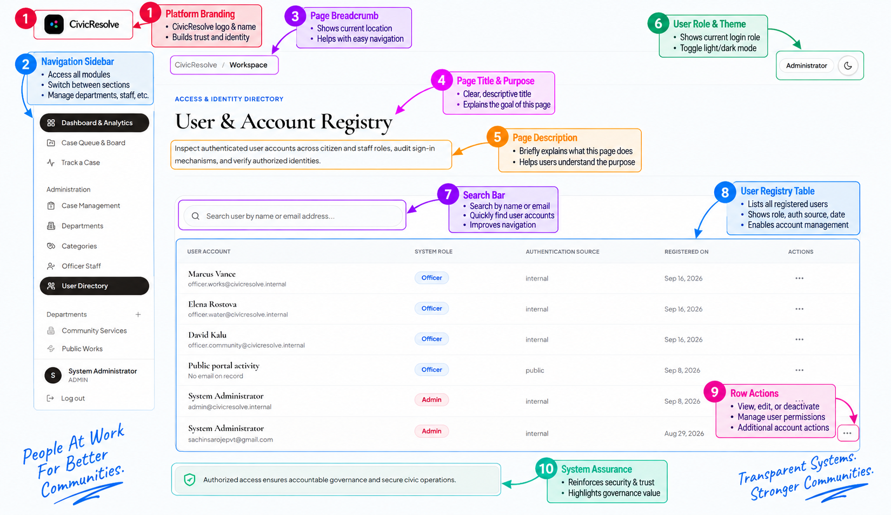

##### 💡 Plain English Explanation
A complete security directory where administrators can see every registered account in the system—both staff officers and administrators. It shows when each account was created, how they sign in, and provides options to manage their permissions or deactivate access if someone leaves the organization.

##### ⚙️ Advanced Engineering Breakdown
- **Route:** `/admin/users` rendered by `client/src/pages/AdminUsers.tsx`.
- **API Procedure:** `admin.users` query in `server/routers.ts`.
- **Zero Credential Exposure:** Password hashes (`passwordHash`) and sensitive session secrets are strictly excluded from the SQL `select` query to guarantee credentials never enter browser memory or network logs.

##### 🔍 Numbered Visual Callouts
| Callout | UI Element | Functional Role & Architecture |
| :--- | :--- | :--- |
| **1** | **Platform Branding** | Official platform logo and header title. |
| **2** | **Navigation Sidebar** | Comprehensive administrative navigation menu. |
| **3** | **Page Breadcrumb** | Breadcrumb trail (`CivicResolve / Workspace / User & Account Registry`). |
| **4** | **Page Title & Purpose** | *"User & Account Registry - Access & Identity Directory"*. |
| **5** | **Page Description** | Highlights identity auditing, authentication mechanisms, and verified credentials. |
| **6** | **User Role & Theme** | Administrative privilege confirmation and theme switcher. |
| **7** | **User Search Bar** | Real-time search filter querying accounts by name or official email address. |
| **8** | **User Registry Table** | Comprehensive tabular directory: User Account, System Role, Auth Source, and Date. |
| **9** | **Row Actions Menu** | Three-dot contextual action menu allowing admins to view, edit, or manage account permissions. |
| **10** | **System Assurance Notice** | Bottom banner reinforcing security principles: *"Authorized access ensures accountable governance"*. |

---

## 🚀 Core Capabilities & Problem Solving

```
┌────────────────────────────────────────────────────────────────────────┐
│                          CIVICRESOLVE PLATFORM                         │
├──────────────────────────┬─────────────────────────┬───────────────────┤
│    PUBLIC & CITIZEN      │    OFFICER WORKSPACE    │    ADMIN CONSOLE  │
├──────────────────────────┼─────────────────────────┼───────────────────┤
│ • Login-Free Submission  │ • Department-Scoped     │ • Global Telemetry│
│ • Token-Based Tracking   │ • Kanban Work Queue     │ • SLA Governance  │
│ • Magic Byte File Upload │ • Status Transitions    │ • Auto Escalation │
│ • Masked Complainant PII │ • Progress Event Logs   │ • Officer Mapping │
│ • 1-Time CSAT Feedback   │ • Immutable Audit Logs  │ • Taxonomy Control│
└──────────────────────────┴─────────────────────────┴───────────────────┘
```

### 1. Friction-Free Public Submission
- **Zero Account Obligation:** Any student or resident can file complaints immediately without mandatory signup or authentication hurdles.
- **Human-Readable Tokens:** Issues are indexed by sequential annual tokens (`GRV-YYYY-XXXXX`) generated via collision-resistant atomic sequence reservation.
- **Evidence Management:** Uploads pass binary signature verification and are accessible only to authorized personnel or via the valid docket token.

### 2. Officer Work Queue & Auditability
- **Role-Based Isolation:** Officers are restricted to cases within their registered department or allocated directly to their workload.
- **Immutable Timeline:** Every reassignment, progress note, or status transition writes an unalterable history event with actor attribution and timestamps.
- **Bulk Operations:** Officers can triage, prioritize, and update multiple tickets simultaneously within their jurisdictional permissions.

### 3. Automated SLA & Escalation Engine
- **Department-Tailored SLAs:** Every department specifies SLA resolution windows (e.g., 24 hours for power outages, 72 hours for street repairs).
- **Dynamic Deadline Projection:** Due dates are computed automatically upon filing in UTC.
- **Periodic Background Cron:** A recurrent 15-minute background watcher evaluates active tickets and elevates breached cases to `critical` priority with automated escalation logs.

---

## 🏛️ System Architecture & Engineering Design

CivicResolve implements an end-to-end type-safe TypeScript architecture, ensuring compile-time contract enforcement between the browser client, API router, and database schema.

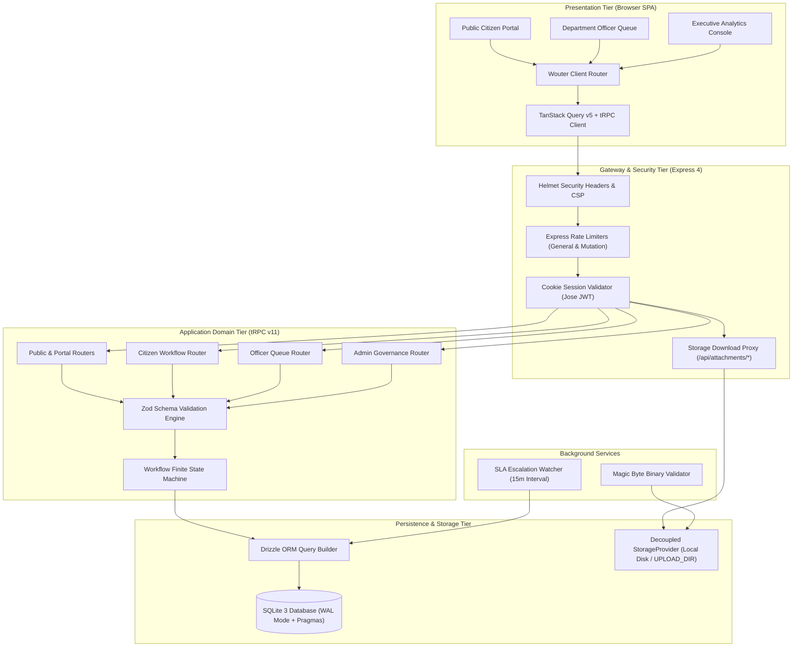
```mermaid
flowchart TD
    subgraph Client["Presentation Tier (Browser SPA)"]
        A["Public Citizen Portal"]
        B["Department Officer Queue"]
        C["Executive Analytics Console"]
        D["Wouter Client Router"]
        E["TanStack Query v5 + tRPC Client"]
    end

    subgraph Gateway["Gateway & Security Tier (Express 4)"]
        F["Helmet Security Headers & CSP"]
        G["Express Rate Limiters (General & Mutation)"]
        H["Cookie Session Validator (Jose JWT)"]
        I["Storage Download Proxy (/api/attachments/*)"]
    end

    subgraph API["Application Domain Tier (tRPC v11)"]
        J["Public & Portal Routers"]
        K["Citizen Workflow Router"]
        L["Officer Queue Router"]
        M["Admin Governance Router"]
        N["Workflow Finite State Machine"]
        O["Zod Schema Validation Engine"]
    end

    subgraph Service["Background Services"]
        P["SLA Escalation Watcher (15m Interval)"]
        Q["Magic Byte Binary Validator"]
    end

    subgraph Persistence["Persistence & Storage Tier"]
        R["Drizzle ORM Query Builder"]
        S[("SQLite 3 Database (WAL Mode + Pragmas)")]
        T["Decoupled StorageProvider (Local Disk / UPLOAD_DIR)"]
    end

    A & B & C --> D
    D --> E
    E --> F
    F --> G
    G --> H
    H --> I & J & K & L & M
    J & K & L & M --> O
    O --> N
    N --> R
    P --> R
    R --> S
    I --> T
    Q --> T
```

---

## 🔄 Grievance Lifecycle & SLA Engine

Grievance statuses transition through a deterministic finite-state machine (FSM). Unauthorized or invalid transitions (such as jumping from `submitted` directly to `resolved` without assignment) are rejected at the API boundary with descriptive validation messages.

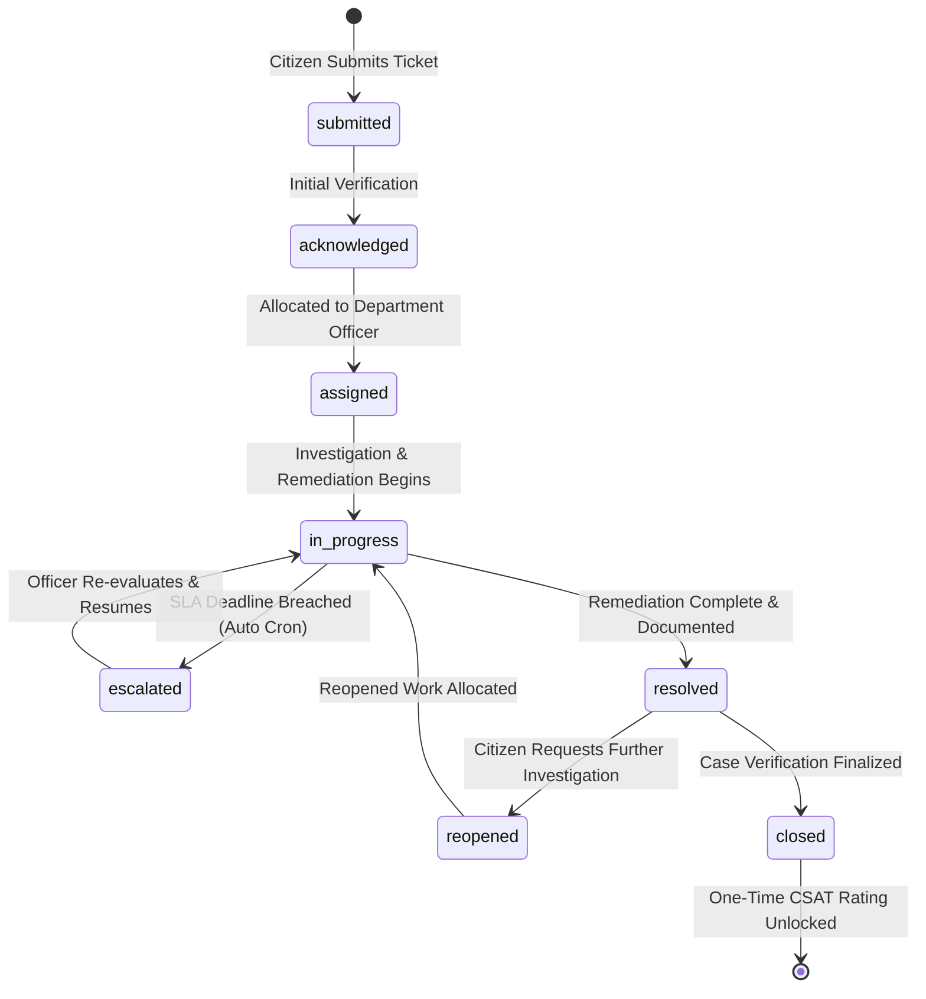
```mermaid
stateDiagram-v2
    [*] --> submitted: Citizen Submits Ticket
    submitted --> acknowledged: Initial Verification
    acknowledged --> assigned: Allocated to Department Officer
    assigned --> in_progress: Investigation & Remediation Begins
    
    in_progress --> escalated: SLA Deadline Breached (Auto Cron)
    escalated --> in_progress: Officer Re-evaluates & Resumes
    
    in_progress --> resolved: Remediation Complete & Documented
    resolved --> reopened: Citizen Requests Further Investigation
    reopened --> in_progress: Reopened Work Allocated
    
    resolved --> closed: Case Verification Finalized
    closed --> [*]: One-Time CSAT Rating Unlocked
```

### State Transition Authority Matrix

| Source State | Permitted Next States | Authorized Roles | Business Requirement |
| :--- | :--- | :--- | :--- |
| `submitted` | `acknowledged` | Administrator | Initial docket review and triage. |
| `acknowledged` | `assigned` | Administrator, Officer | Allocated to specific department officer. |
| `assigned` | `in_progress` | Assigned Officer, Admin | Officer accepts and begins work on docket. |
| `in_progress` | `escalated`, `resolved` | Assigned Officer, Admin, SLA Cron | Requires resolution notes if resolving. |
| `escalated` | `in_progress` | Assigned Officer, Admin | Case reassessed and moved back to active work. |
| `resolved` | `closed`, `reopened` | Citizen (reopen), Staff (close) | Reopening requires explanatory remarks. |
| `reopened` | `in_progress` | Assigned Officer, Admin | Case reopened for secondary remediation. |
| `closed` | *Terminal State* | System / Read-Only | CSAT feedback review becomes available. |

---

## 🔒 Security Architecture & Hardening Specifications

Following the comprehensive Phase 29 audit and release freeze protocol, CivicResolve features enterprise-grade security defaults:

### 1. Server-Side Public DTO Shaping (Privacy Shield)
- Public endpoints (`public.board`, `public.suggestions`, `portal.detail`) enforce explicit DTO response projection.
- Citizen contact emails are dynamically masked (`c***@example.com`).
- Internal citizen records (`user`), officer identities (`assignedOfficer`), and residential street coordinates are completely stripped from public responses.
- Timeline history sanitizes actor identities, rendering generic titles like *"Assigned Officer"* or *"Citizen"* to prevent staff harassment.

### 2. Credential Privacy
- Password hashes (`passwordHash`) are strictly excluded from `auth.me`, `admin.users`, and `admin.officers` procedures, ensuring credentials never touch browser memory or `localStorage`.

### 3. Decoupled Storage & Attachment Proxy
- Decoupled from external Forge API dependencies in favor of a pluggable `StorageProvider` abstraction.
- Zero-dependency `LocalStorageProvider` incorporates strict directory traversal guards (`path.resolve` containment checks).
- File uploads undergo binary magic byte verification (PDF `%PDF`, JPEG `FF D8 FF`, PNG `89 50 4E 47`, WebP `RIFF...WEBP`).
- Download access via `GET /api/attachments/:key` is guarded: users must either possess an authenticated session (with case ownership or departmental assignment) or present the valid tracking docket parameter (`?trackingNumber=...`).

### 4. Database Concurrency & Referential Integrity
- `PRAGMA foreign_keys = ON;` is enforced on every database connection.
- Write-Ahead Logging (`PRAGMA journal_mode = WAL;`) and `PRAGMA busy_timeout = 5000;` prevent lock contention under concurrent load.
- Multi-step mutations are wrapped in atomic Drizzle transactions.
- Ticket serial numbers query the maximum annual sequence with exponential jitter retry logic to prevent duplicate tracking numbers during simultaneous submissions.

### 5. Network Hardening & Rate Limiting
- `helmet` enforces Content Security Policy (CSP), `X-Content-Type-Options: nosniff`, and `X-Frame-Options: SAMEORIGIN`.
- `express-rate-limit` enforces 300 requests per 15 minutes on general `/api/` traffic and 25 requests per 15 minutes on sensitive public mutations (`portal.create`, `portal.uploadAttachment`, `portal.feedback`).

---

## 🛠️ Technology Stack Breakdown

| Architectural Layer | Technology | Version | Engineering Role |
| :--- | :--- | :--- | :--- |
| **Frontend Framework** | React | `^19.2.1` | Concurrent rendering, declarative component state. |
| **Type System** | TypeScript | `^5.9.3` | Strict type checking across client and server. |
| **Styling & Tokens** | Tailwind CSS | `^4.1.14` | High-performance CSS engine with bespoke editorial design tokens. |
| **UI Primitives** | Radix UI | Latest | Unstyled, accessible UI components (Dialog, Tabs, Accordion, Tooltip). |
| **Client Routing** | Wouter | `^3.3.5` | Minimalist (<2KB), performant SPA routing. |
| **API Transport** | tRPC | `^11.6.0` | End-to-end type safety with zero code generation overhead. |
| **Backend Runtime** | Node.js + Express | `v20+` / `4.21` | High-throughput ESM HTTP server. |
| **Database & ORM** | Drizzle ORM + LibSQL / SQLite | `^0.44.5` | Type-safe SQL builder with zero runtime overhead. |
| **Session & Auth** | Jose | `^6.1.0` | Secure JWT creation, signing, and verification. |
| **Data Validation** | Zod | `^4.1.12` | Runtime schema validation for all API inputs. |
| **Security Tooling** | Helmet + Express Rate Limit | `^8.0` / `^7.5` | HTTP security headers and rate limiting. |
| **Test Framework** | Vitest + Testing Library | `^2.1.4` | Fast unit and integration testing suite. |

---

## 🎓 Submission Demo Path & Viva Guide

### Verified Local Demo Accounts

The project includes an automated idempotent seeding script providing test accounts across all roles:

| Role | Email | Password | Assigned Department / Scope |
| :--- | :--- | :--- | :--- |
| **Administrator** | `admin@civicresolve.internal` | `Admin@CivicResolve2026!` | Global System Oversight & Analytics |
| **Officer** | `officer.works@civicresolve.internal` | `Officer@CivicResolve2026!` | Public Works (ID: 1) |
| **Officer** | `officer.water@civicresolve.internal` | `Officer@CivicResolve2026!` | Water and Sanitation (ID: 2) |
| **Officer** | `officer.community@civicresolve.internal` | `Officer@CivicResolve2026!` | Community Services (ID: 3) |

---

### Step-by-Step Viva Presentation Script (5-Minute Walkthrough)

```
1. PUBLIC FILING (Citizen Perspective)
   Navigate to /cases/new
   • Fill out Title: "Broken Streetlight on Campus Main Boulevard"
   • Select Department: "Public Works" | Category: "Street Lighting"
   • Attach sample evidence (PDF or JPG image)
   • Click Submit -> Copy generated tracking number (e.g., GRV-2026-00001)

2. REAL-TIME TRACKING (Transparency Check)
   Navigate to /track
   • Paste tracking number: GRV-2026-00001
   • Notice complainant email is masked (e.g., c***@university.edu)
   • Observe SLA Target Date and initial "Submitted" milestone
   • Download the attached evidence document to verify secure proxy

3. OFFICER TRIAGE & WORKFLOW (Operations Perspective)
   Navigate to /staff/login
   • Sign in as: officer.works@civicresolve.internal / Officer@CivicResolve2026!
   • View assigned queue on /manage
   • Open ticket -> Advance status: Submitted -> Acknowledged -> In Progress
   • Add progress remark: "Dispatching maintenance team to inspect wiring"

4. CASE RESOLUTION & CITIZEN CSAT (Closing the Loop)
   • Mark case as "Resolved" with resolution note: "Replaced photocell and bulb"
   • Switch back to /track/GRV-2026-00001
   • Observe real-time "Resolved" state
   • Submit citizen CSAT feedback rating (5 stars + review comment)

5. EXECUTIVE GOVERNANCE & TELEMETRY (Leadership Perspective)
   Navigate to /staff/login
   • Sign in as: admin@civicresolve.internal / Admin@CivicResolve2026!
   • Open /admin to inspect MTTR metrics, department caseloads, and SLA compliance
```

---

### Academic Viva Questions & Answers

<details>
<summary><strong>Q1: Why choose tRPC over traditional REST or GraphQL?</strong></summary>
<br/>
<em>Answer:</em> tRPC enables direct TypeScript type sharing between backend procedures and frontend React components without requiring intermediate code generation or schema compilation. If a backend database column or validation rule changes, compile-time errors immediately flag affected UI components. This eliminates schema drift, guarantees autocompletion, and reduces payload size compared to GraphQL.
</details>

<details>
<summary><strong>Q2: How does CivicResolve guarantee data integrity during status updates?</strong></summary>
<br/>
<em>Answer:</em> State transitions pass through a centralized finite state machine (<code>assertWorkflowTransition</code>). The server strictly verifies that the proposed transition is legally permissible from the ticket's current status and confirms the actor holds the required role (e.g., only assigned officers or admins can move a ticket to <code>in_progress</code>; citizens can only perform <code>reopened</code>). All related mutations (status update, timeline event creation, attachment linking) are executed inside atomic database transactions.
</details>

<details>
<summary><strong>Q3: How is citizen privacy preserved without requiring a citizen login?</strong></summary>
<br/>
<em>Answer:</em> The platform uses public DTO response shaping. Even though internal database records hold contact emails and residential coordinates, public queries (<code>public.board</code>, <code>public.suggestions</code>, <code>portal.detail</code>) explicitly omit or mask this information before serialization. Citizens look up cases via their unguessable sequential tracking tokens.
</details>

<details>
<summary><strong>Q4: How does the system prevent SQLite concurrency bottlenecks?</strong></summary>
<br/>
<em>Answer:</em> CivicResolve configures SQLite with Write-Ahead Logging (<code>PRAGMA journal_mode = WAL;</code>), allowing concurrent reads to execute simultaneously without blocking ongoing writes. We also set <code>PRAGMA busy_timeout = 5000;</code> so transient write contentions wait up to 5 seconds rather than throwing immediate locks. Sequence numbers query maximum annual serial values with exponential jitter retry logic to handle concurrent insertions gracefully.
</details>

<details>
<summary><strong>Q5: How does the file storage layer defend against malicious uploads?</strong></summary>
<br/>
<em>Answer:</em> Every file upload passes through a 3-layer security check: (1) Extension whitelisting, (2) 2 MB payload ceiling, and (3) Binary magic byte buffer inspection that verifies actual file headers (e.g., verifying <code>%PDF</code> for PDFs or <code>FF D8 FF</code> for JPEGs) to prevent executable renaming attacks. Files are stored with sanitized names via a path-traversal-resistant storage provider and served through an authorized proxy.
</details>

<details>
<summary><strong>Q6: How does automated SLA escalation work in the background?</strong></summary>
<br/>
<em>Answer:</em> When a ticket is created, an exact due date is calculated in UTC based on the department's configured SLA hours. A background cron watcher runs every 15 minutes to query open, unescalated tickets past their due date, automatically elevating their priority to <code>critical</code> and appending an automated escalation record to the audit timeline.
</details>

---

## ⚡ Quick Start & Installation

### Prerequisites
- **Node.js**: `v20.0.0` or higher
- **pnpm**: `v9.0.0` or higher (recommended)

### 1. Clone the Repository
```bash
git clone https://github.com/sachin-saroj/CivicResolve.git
cd CivicResolve
```

### 2. Install Dependencies
```bash
pnpm install
```

### 3. Configure Environment Variables
Copy the template configuration:
```bash
cp .env.example .env
```

The system runs out of the box with zero external infrastructure dependencies using an embedded SQLite database (`local.db`):
```env
NODE_ENV=development
PORT=3000
HOST=0.0.0.0
DATABASE_URL=file:./local.db
JWT_SECRET=use-a-secure-random-key-at-least-32-characters-long
SESSION_SECRET=use-a-secure-random-key-at-least-32-characters-long
UPLOAD_DIR=./uploads
```

### 4. Seed Local Demo Accounts
Initialize the database catalog, departments, administrator account, and sample departmental officers:
```bash
pnpm run seed:admin
```

### 5. Start Development Server
```bash
pnpm run dev
```
Open [http://localhost:3000](http://localhost:3000) in your browser.

---

## 🐳 Docker & Containerized Deployment

CivicResolve is packaged with a multi-stage production [`Dockerfile`](Dockerfile) and [`docker-compose.yml`](docker-compose.yml) configured for single-instance persistent volume storage.

### Deploy with Docker Compose
```bash
# Build and run container in detached mode
docker compose up -d --build

# Verify container status and health probe
docker compose ps
curl http://localhost:3000/health
```

### Docker Volume Persistence
The container mounts persistent volumes for:
- `/data`: Houses the persistent SQLite database file (`civicresolve.db`, `*.db-wal`, `*.db-shm`).
- `/uploads`: Stores verified evidence attachments across container restarts.

---

## 🧪 Verification & Quality Benchmarks

CivicResolve enforces a strict quality gate before any release.

```bash
# Run automated test suite (61 tests across 14 test files)
pnpm test

# Run TypeScript static analysis
pnpm run check

# Run production bundle compilation
pnpm run build
```

### Verified Test Suite Summary (61/61 Passing)
- `server/security.hardening.test.ts` — Public PII masking, magic byte validation, path traversal defense, foreign key verification, concurrent sequence numbers, credential privacy, and attachment download authorization.
- `server/public.portal.test.ts` — Login-free grievance creation, anonymous tracking, and DTO shape validation.
- `server/workflow.test.ts` — Finite state machine transitions, citizen reopen boundaries, and role guards.
- `server/internalAuth.test.ts` — Password hashing, credential verification, and JWT session handling.
- `server/officer.queue.test.ts` — Queue filtering, pagination, and departmental assignment verification.
- `server/staff.scope.test.ts` — Cross-department read/write isolation.
- `server/sla.test.ts` — Dynamic deadline computation and escalation rules.
- `server/catalog.integration.test.ts` — Departmental taxonomy and catalog initialization.
- `server/civic-enhancements.test.ts` — Civic enhancements and search logic.
- `server/auth.logout.test.ts` — Secure multi-cookie revocation.
- `server/public.workflow.feedback.test.ts` — Feedback submission and constraint enforcement.
- `client/src/pages/GrievanceDetail.test.tsx` — UI workflow mutations and timeline rendering.
- `client/src/pages/Phase2Analytics.test.tsx` — Executive analytics telemetry and SLA charts.

---

## 🗺️ Complete API & Route Reference

### Frontend Route Map

| URL Route | Interface | Access Scope | Description |
| :--- | :--- | :--- | :--- |
| `/` | Public Home & Manifesto | Public | Editorial landing, Fast Docket Lookup, civic metrics, service folders. |
| `/cases/new` | Grievance Filing | Public | 4-step submission form with category routing and evidence upload. |
| `/track` | Tracking Gateway | Public | Search portal for public tracking tokens. |
| `/track/:trackingNumber` | Public Docket Tracker | Public | Real-time milestone tracker, masked details, and CSAT feedback. |
| `/staff/login` | Staff Gateway | Public | Credential authentication portal for officers and administrators. |
| `/manage` | Operations Workspace | Officer / Admin | Filterable, sortable Kanban queue with bulk triage operations. |
| `/officer/cases/:trackingNumber` | Internal Case Management | Officer / Admin | Case investigation view, progress event logging, and status transitions. |
| `/admin` | Executive Telemetry | Administrator | Global metrics, SLA compliance heatmaps, and department volume. |
| `/admin/cases` | Comprehensive Triage | Administrator | Full tabular case docket with inline officer assignment. |
| `/admin/departments` | Department Registry | Administrator | Configure active departments and SLA resolution hours. |
| `/admin/categories` | Category Taxonomy | Administrator | Manage hierarchical grievance categories and department mappings. |
| `/admin/officers` | Officer Assignments | Administrator | Connect authenticated staff members to departmental branches. |
| `/admin/users` | Identity Directory | Administrator | User account registry, role verification, and access auditing. |

---

### Backend tRPC API Routers

| Router | Procedure | Type | Access Level | Description |
| :--- | :--- | :--- | :--- | :--- | :--- |
| `auth` | `me` | Query | Public | Returns authenticated user info (strictly omitting `passwordHash`). |
| `auth` | `internalLogin`| Mutation| Public (Throttled) | Validates email/password and sets secure HTTP-only JWT cookie. |
| `auth` | `logout` | Mutation| Public | Revokes session and clears authentication cookies. |
| `public` | `catalog` | Query | Public | Returns active departments and available grievance categories. |
| `public` | `board` | Query | Public | Returns sanitized public grievances (PII and residential location stripped). |
| `public` | `suggestions` | Query | Public | Fast autocomplete suggestions (omitting location and email data). |
| `public` | `lookup` | Query | Public | Fast status lookup for tracking tokens. |
| `portal` | `create` | Mutation| Public (Throttled) | Files a public grievance under the public service actor. |
| `portal` | `detail` | Query | Public | Returns sanitized case DTO with masked email and authorized attachment URLs. |
| `portal` | `uploadAttachment`| Mutation| Public (Throttled)| Uploads evidence document with magic byte buffer validation. |
| `portal` | `feedback` | Mutation| Public (Throttled)| Submits post-resolution 1-5 star CSAT feedback review. |
| `citizen` | `dashboard` | Query | Citizen (`user`) | Returns user's filed grievances and status distribution. |
| `citizen` | `reopen` | Mutation| Citizen (`user`) | Reopens a resolved case with mandatory explanation. |
| `officer` | `queue` | Query | Officer / Admin | Department-scoped case queue with filtering and sorting. |
| `officer` | `updateCase` | Mutation| Officer / Admin | Advances grievance workflow status with FSM transition verification. |
| `officer` | `addProgress`| Mutation| Officer / Admin | Appends progress notes or actions taken to case history. |
| `officer` | `bulkUpdate` | Mutation| Officer / Admin | Batch-updates priority or status for multiple assigned cases. |
| `admin` | `dashboard` | Query | Admin Only | Aggregated system metrics, MTTR, and SLA breach heatmaps. |
| `admin` | `assign` | Mutation| Admin Only | Allocates a grievance to a designated departmental officer. |
| `admin` | `createDepartment`| Mutation| Admin Only | Adds a new department with custom SLA turnaround hours. |
| `admin` | `createCategory`| Mutation| Admin Only | Creates a grievance category linked to a department. |
| `admin` | `assignOfficer`| Mutation| Admin Only | Connects an authenticated user to a department as an officer. |
| `admin` | `users` | Query | Admin Only | Returns registered user accounts (strictly omitting `passwordHash`). |

---

## 📂 Project Directory Structure

```
├── client/                     # Frontend Application (React 19 SPA)
│   ├── src/
│   │   ├── _core/              # Authentication hooks & utilities
│   │   ├── components/         # Reusable UI primitives & editorial layouts
│   │   ├── contexts/           # Theme (light/dark) and state providers
│   │   ├── hooks/              # Custom React application hooks
│   │   ├── pages/              # Route pages (Landing, Tracker, Manage, Admin)
│   │   ├── App.tsx             # Main router & provider orchestration
│   │   └── index.css           # Tailwind v4 configuration & editorial tokens
│   └── index.html              # HTML shell & font preloading
├── drizzle/                    # Database Architecture
│   ├── schema.ts               # Drizzle table definitions, relations & indexes
│   └── migrations/             # SQL migration files
├── server/                     # Backend Application (Node.js + Express + tRPC)
│   ├── _core/                  # Express configuration, security headers & context
│   │   ├── index.ts            # Server entrypoint, rate limiters, health routes
│   │   ├── storageProxy.ts     # Authorized attachment download proxy
│   │   └── sdk.ts              # Authentication & session token utilities
│   ├── db.ts                   # SQLite connection, pragmas, transactions & queries
│   ├── internalAuth.ts         # Scrypt password hashing & JWT management
│   ├── routers.ts              # tRPC API route handlers & procedure guards
│   ├── seed-admin.ts           # Admin & officer account initialization script
│   ├── storage.ts              # Storage facade adapter
│   ├── storageProvider.ts      # LocalStorageProvider with path traversal defense
│   ├── workflow.ts             # Grievance finite state machine (FSM)
│   └── *.test.ts               # Automated Vitest unit & integration test suites
├── docs/                       # Project Documentation & Verification Records
│   ├── FINAL-PRODUCTION-READINESS-REPORT.md
│   ├── PRODUCTION-DEPLOYMENT-REQUIREMENTS.md
│   ├── PHASE-29-SECURITY-HARDENING-REPORT.md
│   └── screenshots/            # 14 High-definition annotated architectural captures
├── Dockerfile                  # Multi-stage production container build
├── docker-compose.yml          # Containerized deployment with volume persistence
├── .env.example                # Environment configuration template
├── package.json                # Project dependencies & scripts
├── tsconfig.json               # TypeScript strict configuration
└── vite.config.ts              # Vite bundler configuration
```

---

## 📄 License & Attribution

This project is licensed under the **MIT License**. Created with dedication for academic excellence and civic engineering.

**Author:** [Sachin Saroj](https://github.com/sachin-saroj)  
**Repository:** [https://github.com/sachin-saroj/CivicResolve](https://github.com/sachin-saroj/CivicResolve)
