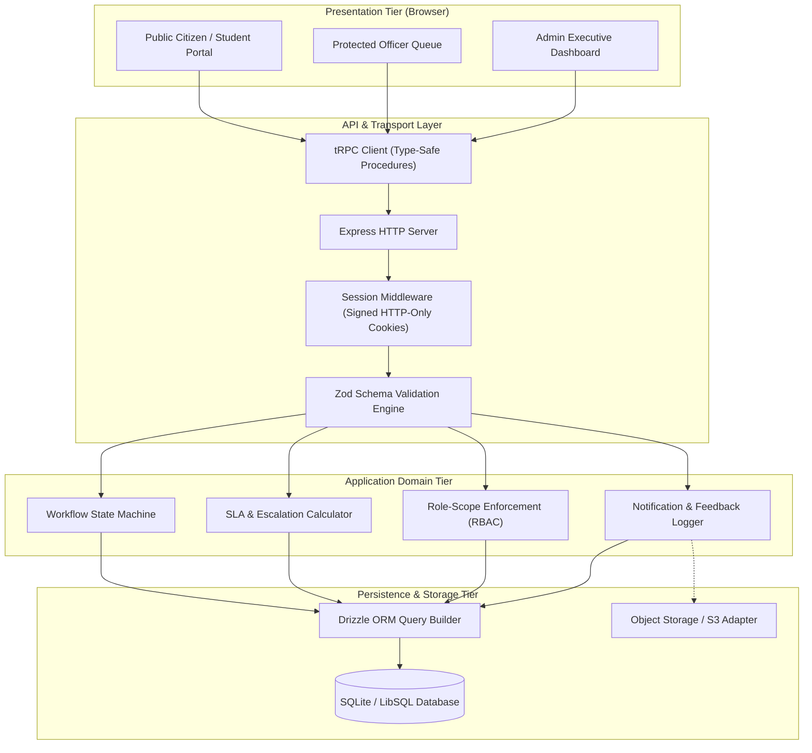
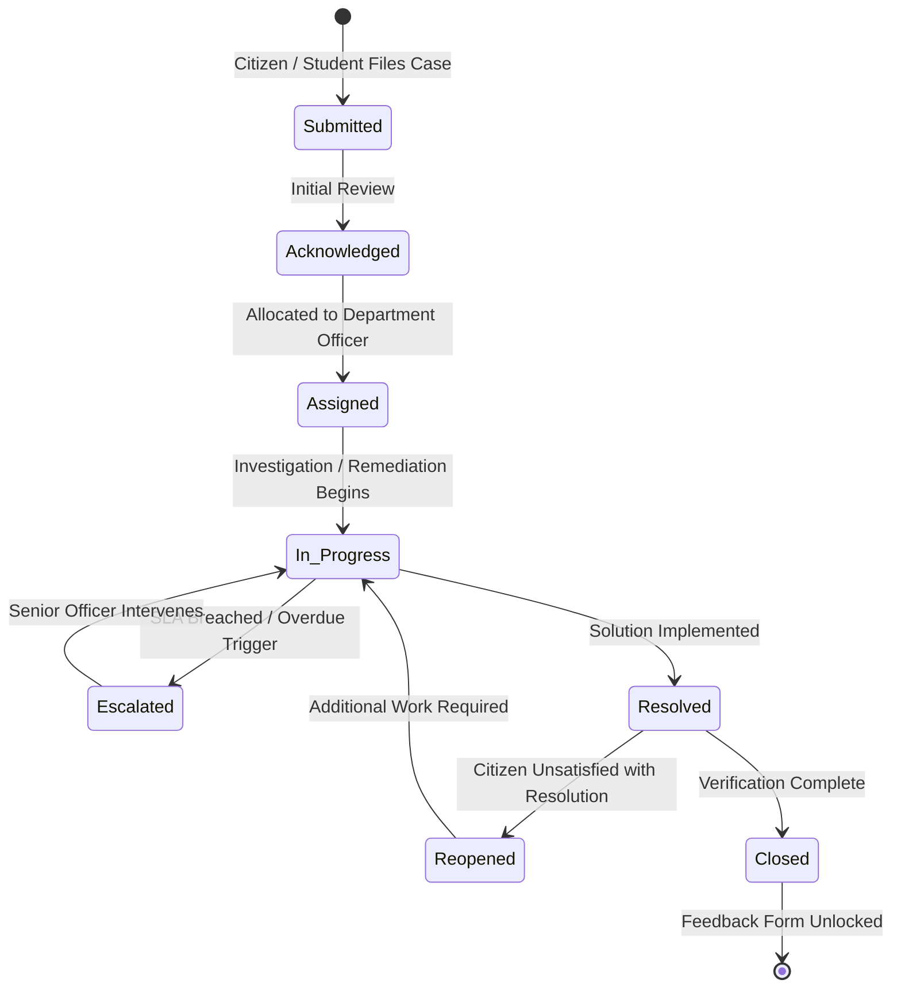

<div align="center">

# 🏛️ CivicResolve
### Modern Grievance Redressal & SLA Management System

*A full-stack, enterprise-grade civic and campus grievance portal engineered for transparent tracking, automated SLA governance, and friction-free citizen & student experience.*

---

[](https://react.dev/)
[](https://www.typescriptlang.org/)
[](https://nodejs.org/)
[](https://trpc.io/)
[](https://orm.drizzle.team/)
[](https://tailwindcss.com/)
[](https://vitest.dev/)
[](LICENSE)

[Architecture Overview](#-architecture--system-design) •
[Core Capabilities](#-core-capabilities) •
[Workflow & SLA](#-grievance-lifecycle--sla-engine) •
[Quick Start](#-quick-start--installation) •
[API & Route Map](#-routes--access-boundaries) •
[Academic & Viva Guide](#-academic--viva-presentation-guide)

</div>

---

## 📌 Executive Summary

**CivicResolve** is an end-to-end grievance redressal system designed to eliminate bureaucratic opacity in campus administrations and civic bodies. Traditional grievance portals suffer from forced registration barriers, untracked delays, and missing accountability. 

CivicResolve resolves this through a **dual-architecture paradigm**:
1. **Public Citizen / Student Portal:** A login-free, zero-friction interface where users submit issues with optional multimedia evidence and track progress in real time via secure, human-readable reference tokens (e.g. `GRV-2026-00017`).
2. **Internal Operations Workspace:** A cryptographically secured workspace for officers and administrators featuring role-scoped triage queues, automated Service Level Agreement (SLA) deadlines, overdue escalation routines, and real-time operational analytics.

---

## 🚀 Core Capabilities

```
┌────────────────────────────────────────────────────────────────────────┐
│                          CIVICRESOLVE PLATFORM                         │
├──────────────────────────┬─────────────────────────┬───────────────────┤
│    PUBLIC & CITIZEN      │    OFFICER WORKSPACE    │    ADMIN CONSOLE  │
├──────────────────────────┼─────────────────────────┼───────────────────┤
│ • Login-Free Submission  │ • Department Scope      │ • Global Queue    │
│ • Secure Tracking Token  │ • Assigned Case Queue   │ • SLA Oversight   │
│ • Document Attachment    │ • Status Transitions    │ • Auto Escalation │
│ • Audit History Log      │ • Internal Progress Log │ • Officer Load    │
│ • 1-Time Feedback & CSAT │ • Audit Trail History   │ • BI & Analytics  │
└──────────────────────────┴─────────────────────────┴───────────────────┘
```

### 1. Frictionless Public Interface
- **Zero-Barrier Filing:** Citizens and students can log complaints immediately without mandatory account creation or phone OTP delays.
- **Token-Based Tracking:** Instant generation of human-readable tracking identifiers (`GRV-YYYY-XXXXX`) for anonymous, tamper-proof status lookups.
- **Evidence Management:** Upload supporting images, logs, or documents directly linked to the grievance record.
- **Post-Resolution CSAT:** A one-time feedback rating and review system unlocked only after case closure to prevent poll stuffing.

### 2. Department-Scoped Officer Queue
- **Role-Based Access Control (RBAC):** Officers only access cases within their assigned department or explicitly allocated to their workload.
- **Lifecycle Mutation Safety:** State changes (e.g., *In Progress*, *Resolved*, *Closed*) are strictly verified by a server-side state machine.
- **Progress Remarks & Auditing:** Every note or status transition logs an immutable entry in the audit history table with actor references and timestamps.

### 3. Intelligent SLA & Escalation Engine
- **Department-Configured SLAs:** Each department maintains configurable turnaround deadlines (e.g., 24h, 48h, 72h).
- **Automated UTC Deadlines:** Timestamps are computed upon creation in coordinated UTC.
- **Idempotent Escalation:** Overdue grievances are automatically elevated to `critical` priority with automated escalation notifications logged to the system.

### 4. Executive Analytics & Governance
- **Operational Metrics:** Live calculation of mean time to resolution (MTTR), open case ratios, and department-wise volume.
- **Workload Balancing:** Visual distribution of open cases across active officers to prevent operational bottlenecks.
- **Category Intelligence:** Aggregation of recurring issue categories to identify systemic campus/civic infrastructure failures.

---

## 🏛️ Architecture & System Design

CivicResolve is built with an end-to-end type-safe TypeScript architecture, ensuring compile-time contract enforcement between the browser client, API layer, and database.



---

## 🔄 Grievance Lifecycle & SLA Engine

Grievance statuses transition through a deterministic finite-state machine. Invalid or out-of-order state transitions are rejected with descriptive errors at the API boundary.



### State Machine Transition Rules

| Initial State | Permitted Transitions | Actor Permissions |
|---|---|---|
| `submitted` | `acknowledged`, `assigned` | Administrator |
| `acknowledged` | `assigned`, `in_progress` | Administrator, Department Officer |
| `assigned` | `in_progress` | Assigned Officer, Administrator |
| `in_progress` | `escalated`, `resolved` | Assigned Officer, Administrator, SLA Cron |
| `escalated` | `in_progress`, `resolved` | Assigned Officer, Administrator |
| `resolved` | `reopened`, `closed` | Citizen (reopen), Staff (close) |
| `reopened` | `in_progress` | Assigned Officer, Administrator |
| `closed` | *Terminal State* | Immutable, Feedback Enabled |

---

## 🛣️ Routes & Access Boundaries

| URL Route | Interface Area | Access Scope | Description |
|---|---|---|---|
| `/` | Public Home | Unrestricted | Portal landing page, overview, and quick action links. |
| `/cases/new` | Grievance Filing | Unrestricted | Validated submission form with category picker & attachment support. |
| `/track` | Tracking Gateway | Unrestricted | Instant token lookup for public grievances. |
| `/cases/:trackingNumber` | Public Case Record | Unrestricted | Read-only case timeline, resolution status, and feedback submission. |
| `/staff/login` | Staff Gateway | Unrestricted | Secure password authentication for internal personnel. |
| `/manage` | Staff Workspace | Officer / Admin | Filterable, sortable queue with pagination and bulk triage actions. |
| `/officer/cases/:trackingNumber` | Case Detail View | Officer / Admin | Protected case management, status mutations, and officer notes. |
| `/admin` | Admin Analytics | Administrator | Workload graphs, SLA breach counters, and department metrics. |

---

## 🛠️ Technology Stack

| Layer | Technology | Key Details |
|---|---|---|
| **Frontend UI** | React 19 + TypeScript | High-performance modern React with concurrent rendering. |
| **Styling & Design** | Tailwind CSS v4 + Radix UI | Scandinavian minimalist palette, Accessible Radix primitives. |
| **Routing** | Wouter | Lightweight, minimalist client-side routing. |
| **API Transport** | tRPC v11 + SuperJSON | End-to-end type safety without boilerplate code generation. |
| **Backend Runtime** | Node.js + Express | Robust HTTP foundation with modular router architecture. |
| **Database & ORM** | Drizzle ORM + LibSQL / SQLite | Zero-overhead typed SQL queries with zero migration lock-in. |
| **Authentication** | jose (JWT) + scrypt | Timing-safe scrypt password hashing + secure HTTP-only cookies. |
| **Input Validation** | Zod | Runtime schema validation on all inputs and API parameters. |
| **Test Suite** | Vitest + Testing Library | 50 passing tests across 14 suites (unit + integration + jsdom). |

---

## ⚡ Quick Start & Installation

### Prerequisites
- **Node.js**: `v20.0.0` or higher
- **pnpm**: `v9.0.0` or higher (recommended)

### 1. Clone the Repository
```bash
git clone https://github.com/sachin-saroj/clg-project.git
cd clg-project
```

### 2. Install Dependencies
```bash
pnpm install
```

### 3. Configure Environment Variables
Copy the example environment file:
```bash
cp .env.example .env
```

The system runs out of the box with zero external configuration using an embedded SQLite database (`local.db`):
```env
# Database connection string (defaults to local SQLite file:./local.db)
DATABASE_URL=file:./local.db

# JWT session secret key (minimum 32 characters)
JWT_SECRET=civic-resolve-super-secret-key-must-be-32-chars-long-2026

# Server Port
PORT=3000
```

### 4. Seed the Default Administrator Account
Execute the automated administrator seeding script:
```bash
pnpm run seed:admin
```
> **Default Admin Credentials:**
> - **Email:** `admin@civicresolve.internal`
> - **Password:** `Admin@CivicResolve2026!`

### 5. Start the Development Server
```bash
pnpm run dev
```
Open [http://localhost:3000](http://localhost:3000) in your browser to view the application.

---

## 🧪 Verification & Quality Benchmarks

CivicResolve includes a robust automated test suite validating security boundaries, SLA calculations, role scopes, and user workflows.

```bash
# Run the entire test suite in serialized mode
pnpm test -- --run --pool=forks --maxWorkers=1 --minWorkers=1
```

```bash
# Run TypeScript static analysis
pnpm run check
```

```bash
# Run production production bundle compilation
pnpm run build
```

### Verified Test Suite Breakdown (50 Passing Tests)
- `server/public.workflow.feedback.test.ts` — Feedback submission & constraint enforcement
- `server/internalAuth.test.ts` — Password hashing, scrypt verification, and JWT session creation
- `server/sla.test.ts` — Dynamic deadline computation and escalation rules
- `server/staff.scope.test.ts` — Cross-department read/write protection
- `server/officer.queue.test.ts` — Queue filtering, pagination, and assignment verification
- `server/public.portal.test.ts` — Login-free grievance creation and token validation
- `server/workflow.test.ts` — Finite state machine transitions and invalid edge cases
- `client/src/pages/GrievanceDetail.test.tsx` — JSDOM UI rendering and mutation integration
- `client/src/pages/Phase2Analytics.test.tsx` — Dashboard metrics calculation and rendering

---

## 🎓 Academic & Viva Presentation Guide

This section provides technical answers and talking points for university project presentations and technical vivas.

### 1. Problem Statement
Manual grievance handling in institutions leads to lack of accountability, lost paperwork, ambiguous resolution timelines, and student hesitation due to privacy concerns. CivicResolve solves this by combining **anonymous tracking tokens** with **automated SLA escalation**.

### 2. Key Technical Innovations
- **Login-Free Privacy Model:** Utilizes cryptographically generated UUID tokens for complaint tracking, allowing students/citizens to report sensitive issues (e.g., harassment, infrastructure hazards) without exposing identity.
- **End-to-End Type Safety:** Using tRPC and Drizzle ORM, schema modifications in the database immediately propagate types into React UI components at compile time, eliminating an entire class of runtime bugs.
- **Non-Blocking Observability:** Email logging and notification persistence are intentionally decoupled from transactional writes, ensuring failure of auxiliary services never disrupts grievance operations.

### 3. Viva Questions & Answers
<details>
<summary><strong>Q1: Why choose tRPC over traditional REST or GraphQL?</strong></summary>
<br/>
<em>Answer:</em> tRPC allows direct TypeScript type sharing between the backend router and frontend client without code generation. This reduces schema drift, ensures 100% autocompletion in IDEs, and minimizes network overhead compared to GraphQL client libraries.
</details>

<details>
<summary><strong>Q2: How is data integrity guaranteed during status updates?</strong></summary>
<br/>
<em>Answer:</em> All status transitions pass through a centralized workflow validator. If an officer attempts an unauthorized transition (such as skipping directly from <code>submitted</code> to <code>resolved</code> without investigation), the server rejects the query with a <code>BAD_REQUEST</code> error and records an audit incident.
</details>

<details>
<summary><strong>Q3: How does the system handle high concurrency during public submissions?</strong></summary>
<br/>
<em>Answer:</em> The persistence layer uses indexed queries on unique tracking numbers and foreign keys. Attachment processing delegates binary storage to object storage, keeping database rows lightweight and cache-friendly.
</details>

---

## 📂 Project Directory Structure

```
├── client/                     # Frontend Application
│   ├── src/
│   │   ├── _core/              # Core authentication & utilities
│   │   ├── components/         # Reusable UI primitives & layouts
│   │   ├── contexts/           # Theme and state providers
│   │   ├── hooks/              # Custom React hooks
│   │   ├── pages/              # Route pages (Home, Tracker, Dashboards)
│   │   ├── App.tsx             # Main router & provider setup
│   │   └── index.css           # Tailwind v4 configuration & tokens
│   └── index.html              # HTML shell
├── drizzle/                    # Database Migrations & Schemas
│   ├── schema.ts               # Drizzle table definitions & relationships
│   └── migrations/             # SQL migration files
├── server/                     # Backend Application
│   ├── _core/                  # Server configuration, env & cookies
│   ├── db.ts                   # LibSQL / SQLite database connection
│   ├── internalAuth.ts         # Scrypt password hashing & JWT management
│   ├── routers.ts              # tRPC API route handlers & procedures
│   ├── seed-admin.ts           # Admin user initialization script
│   ├── storage.ts              # File attachment storage adapter
│   ├── workflow.ts             # Grievance lifecycle state machine
│   └── *.test.ts               # Comprehensive Vitest test suites
├── shared/                     # Shared Types & Constants
├── drizzle.config.ts           # Drizzle Kit configuration
├── package.json                # Project dependencies & scripts
├── tsconfig.json               # TypeScript strict configuration
└── vite.config.ts              # Vite bundler configuration
```

---

## 📄 License & Attribution

This project is licensed under the **MIT License**. Created with dedication for academic excellence and civic engineering.

**Author:** [Sachin Saroj](https://github.com/sachin-saroj)  
**Repository:** [sachin-saroj/clg-project](https://github.com/sachin-saroj/clg-project)
