<div align="center">

# 🏛️ CivicResolve
### Modern Civic Grievance Redressal, SLA Governance & Telemetry Platform

*A production-hardened, full-stack grievance redressal platform engineered for radical administrative transparency, automated SLA governance, and a friction-free citizen & student experience.*

---

[](https://react.dev/)
[](https://www.typescriptlang.org/)
[](https://nodejs.org/)
[](https://trpc.io/)
[](https://orm.drizzle.team/)
[](https://sqlite.org/)
[](https://tailwindcss.com/)
[](https://vitest.dev/)
[](docs/PHASE-29-SECURITY-HARDENING-REPORT.md)
[](Dockerfile)
[](LICENSE)

<br/>

[Executive Summary](#-executive-summary) •
[Interactive Interface Gallery](#-interface-gallery-direct-browser-captures) •
[Core Innovations](#-core-capabilities--problem-solving) •
[System Architecture](#-system-architecture--engineering-design) •
[Workflow & SLA Engine](#-grievance-lifecycle--sla-engine) •
[Security Architecture](#-security-architecture--hardening-specifications) •
[Demo & Viva Guide](#-submission-demo-path--viva-guide) •
[Quick Start](#-quick-start--installation) •
[Docker Deployment](#-docker--containerized-deployment) •
[API Reference](#-complete-api--route-reference)

</div>

---

## 📌 Executive Summary

Municipal bodies and university campus administrations frequently struggle with bureaucratic opacity, lost paperwork, untracked delays, and citizen hesitation caused by forced registration barriers.

**CivicResolve** addresses these systemic challenges through a **dual-architecture paradigm**:

1. **Zero-Barrier Public Portal:** Citizens and students can log grievances immediately without mandatory account creation or phone OTP delays. Each submission generates an immutable tracking token (e.g., `GRV-2026-00017`), allowing users to follow real-time progress, download evidence, and submit post-resolution feedback while keeping personal contact details strictly shielded.
2. **Operations & Executive Workspace:** A role-based workspace for departmental officers and system administrators with live triage queues, automated Service Level Agreement (SLA) countdowns, background escalation cron routines, and interactive executive analytics.

---

### ⚖️ Traditional Grievance Portals vs. CivicResolve

| Operational Vector | Traditional Campus / Civic Portals | CivicResolve |
| :--- | :--- | :--- |
| **User Onboarding** | Mandatory registration, phone OTPs, captcha fatigue | **Instant login-free filing** with auto-generated tracking tokens |
| **Data Privacy** | Raw citizen PII and contact info exposed across staff views | **Server-side public DTO shaping** with automated email masking |
| **SLA Enforcement** | Manual escalation, forgotten tickets, opaque delays | **Automated background SLA cron** with dynamic deadline triggers |
| **File Attachments** | Unchecked uploads vulnerable to malware & spoofing | **Binary magic byte inspection** (PDF, PNG, JPG, WebP) + proxy |
| **Data Integrity** | Prone to race conditions and duplicate tracking IDs | **SQLite WAL mode**, atomic Drizzle transactions, sequence retry |
| **Visual Design** | Cluttered, sterile, generic government SaaS | **Editorial tactile aesthetic** (Playfair serif, brass badges, dark mode) |

---

## 📸 Interface Gallery (Direct Browser Captures)

> **Authentic Interface Captures:** All visual assets below are unaltered captures from the live CivicResolve application running in production mode.

---

### Flow 1: Public Citizen & Student Experience

#### 1.1 Editorial Portal Hero & Fast Docket Lookup (`/`)
*The landing experience combines refined typography with an instant docket lookup bar, live civic metrics, and quick service discovery folders.*


<br/>

#### 1.2 Civic Dossier & Public Service Manifesto (`/`)
*Features interactive service category dossiers, department response pledges, and transparent turnaround standards.*
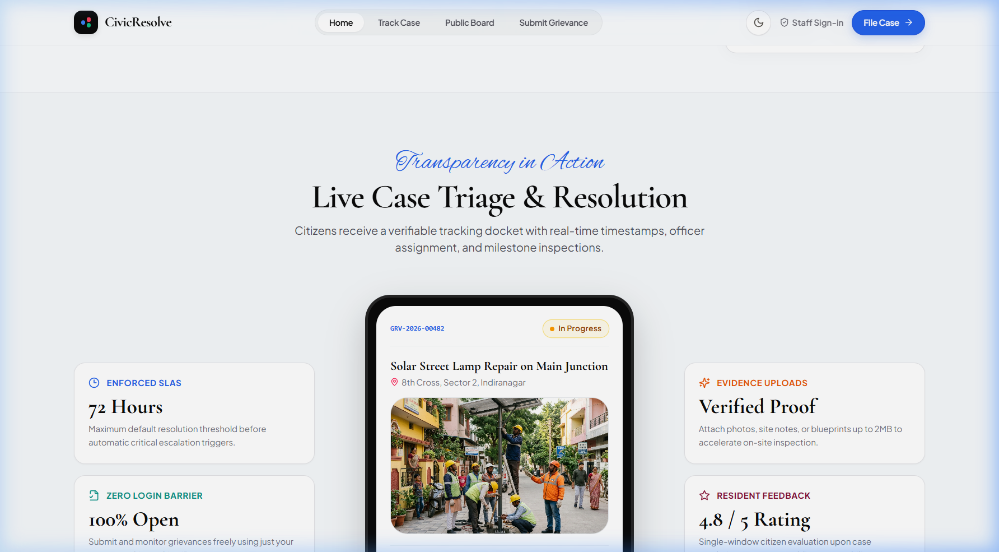

<br/>

#### 1.3 3-Step Guided Grievance Submission (`/cases/new`)
*A validated, multi-stage filing experience with departmental routing, automated SLA calculation, and secure evidence dropzone.*
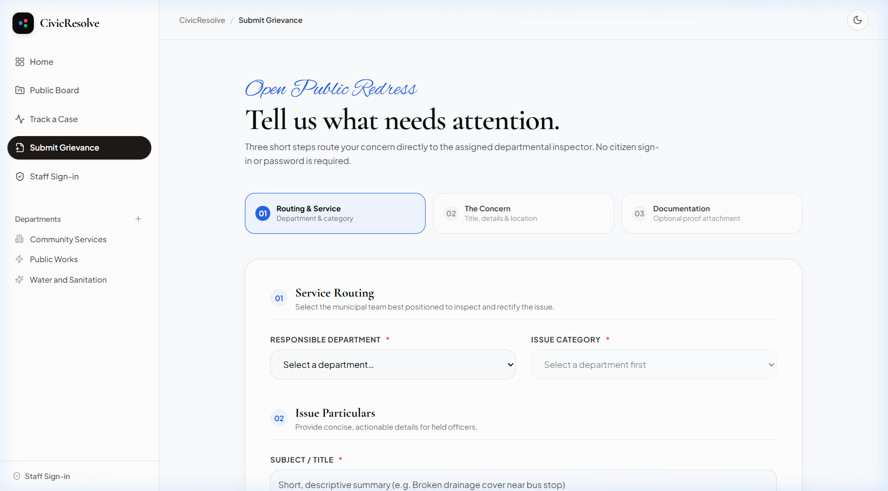

<br/>

#### 1.4 Real-Time Public Docket Tracker (`/track` & `/track/:trackingNumber`)
*Citizens track grievance progress in real time with milestone progress bars, masked email protection, verified document downloads, and post-resolution CSAT feedback.*


<br/>

#### 1.5 Mobile Responsive Citizen Journey (375px Viewport)
*Full responsive adaptation ensuring seamless touch interactions, collapsible navigation, and legible card hierarchies on mobile devices.*

| Mobile Landing & Lookup (`/`) | Mobile Case Submission (`/cases/new`) |
|:---:|:---:|
| 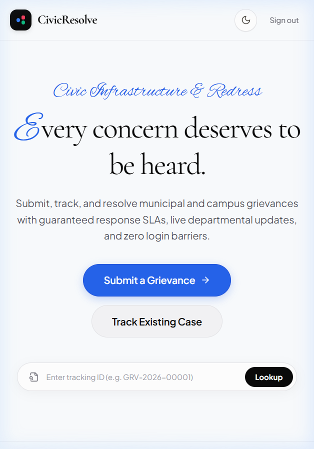 | 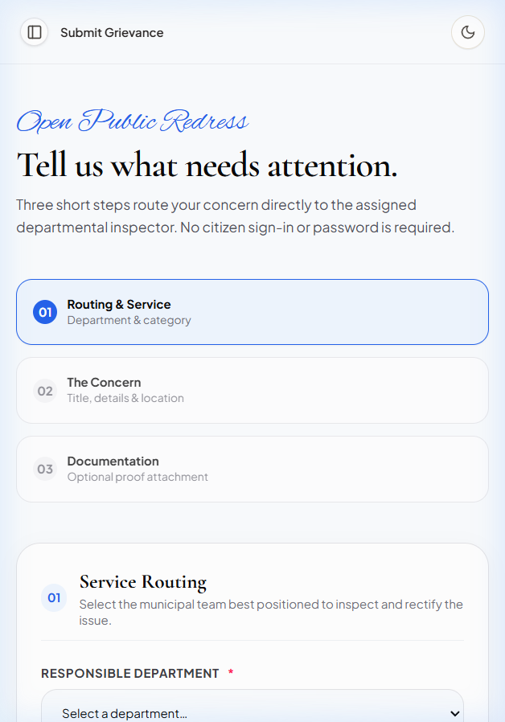 |

---

### Flow 2: Operations Workspace for Officers & Staff

#### 2.1 Staff & Officer Authentication Gateway (`/staff/login`)
*Cryptographically secured authentication gateway with timing-safe password verification, brute-force rate limiting, and HTTP-only signed JWT session cookies.*
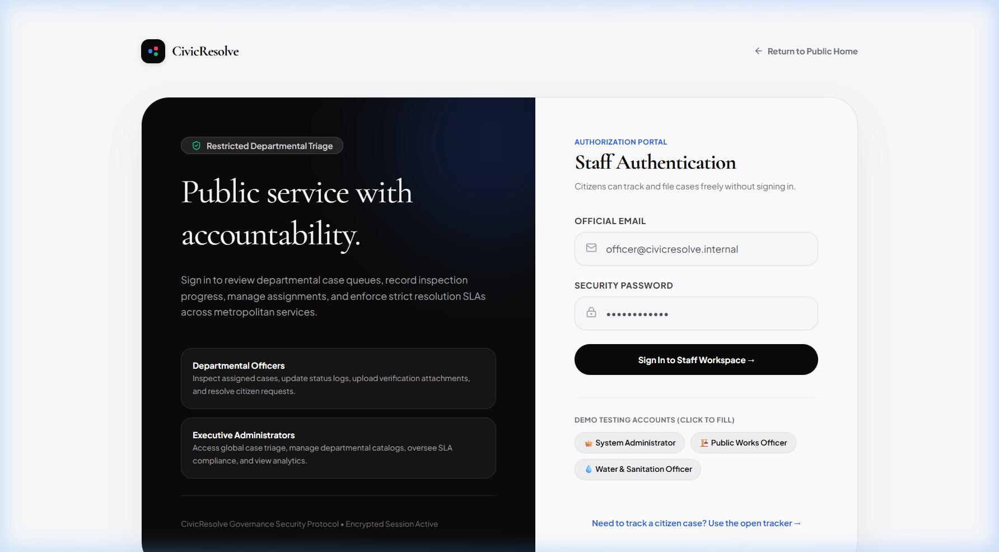

<br/>

#### 2.2 Departmental Officer Queue & Case Board (`/manage`)
*Department-scoped case board featuring multi-parameter filters (status, priority, category, date), overdue SLA badges, and bulk workflow operations.*
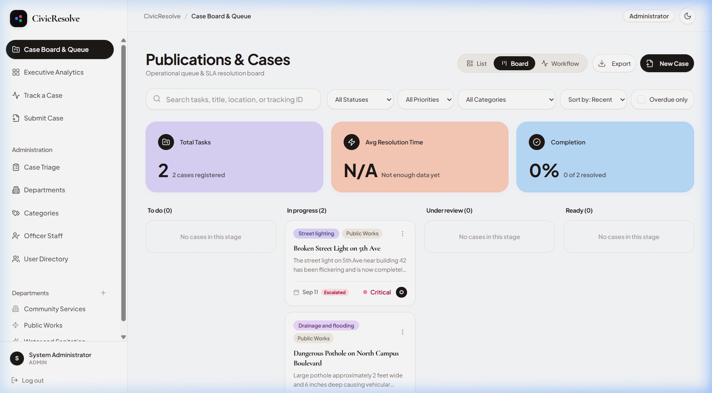

---

### Flow 3: Executive Governance & Administrative Telemetry

#### 3.1 Executive Analytics & SLA Heatmaps (`/admin`)
*Comprehensive operational telemetry displaying Mean Time to Resolution (MTTR), department-wise case distributions, overdue heatmaps, and officer load balances.*


<br/>

#### 3.2 Department Registry & SLA Management (`/admin/departments`)
*Administrative console to configure municipal/campus departments, define custom SLA target hours (24h to 720h), and manage active departmental jurisdictions.*
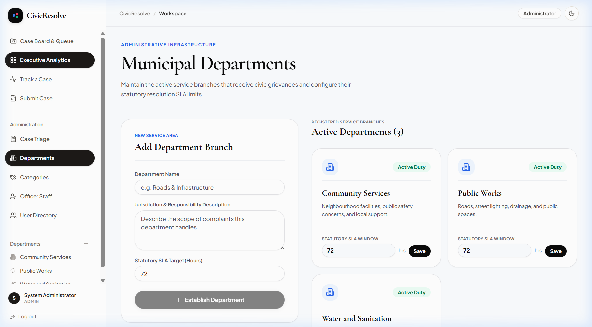

<br/>

#### 3.3 Category Taxonomy Configuration (`/admin/categories`)
*Hierarchical category mapping assigning specific grievance classifications to governing departments.*
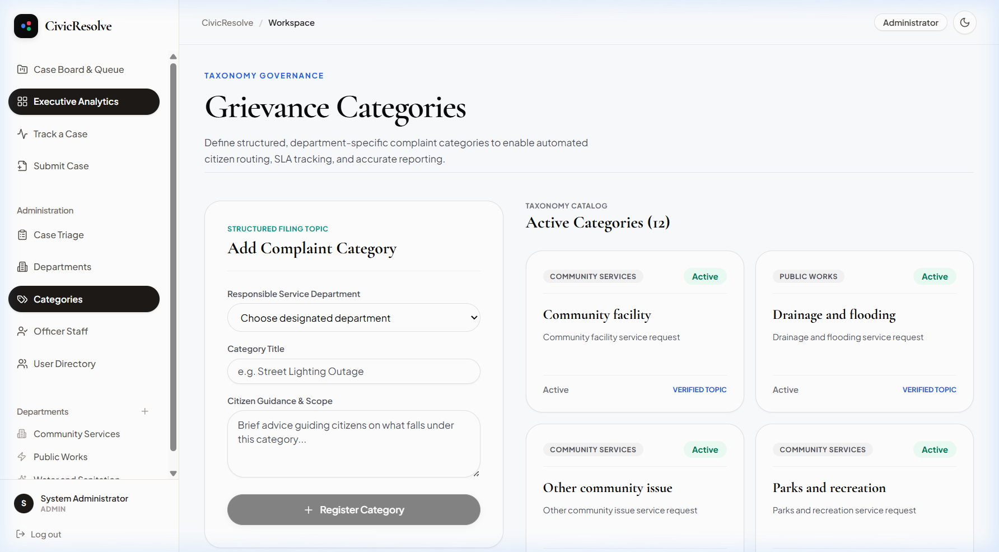

<br/>

#### 3.4 Custom Editorial 404 Docket Handler (`/not-found`)
*Bespoke error handling maintaining consistent typography and clear recovery navigation back to active services.*
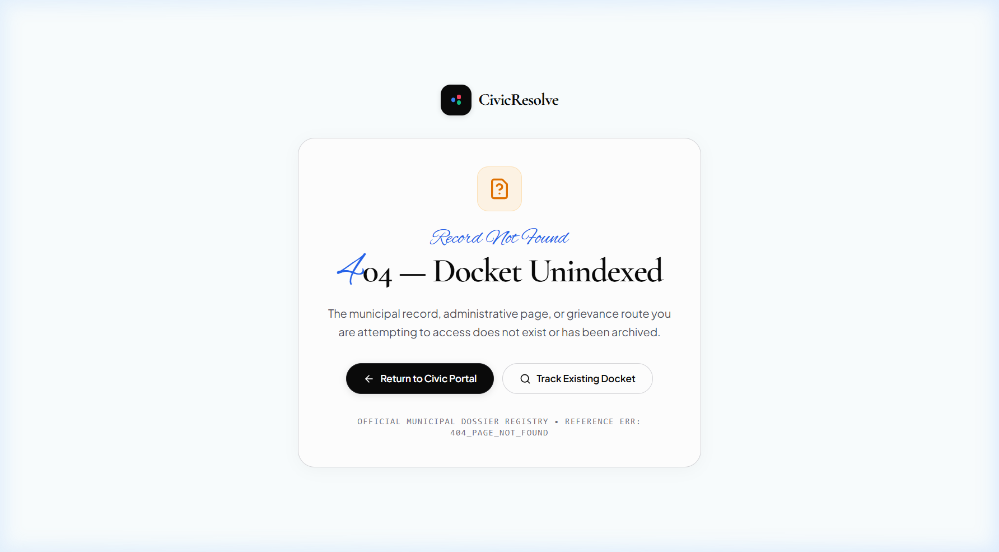

---

## 🚀 Core Capabilities & Problem Solving

```
┌────────────────────────────────────────────────────────────────────────┐
│                          CIVICRESOLVE PLATFORM                         │
├──────────────────────────┬─────────────────────────┬───────────────────┤
│    PUBLIC & CITIZEN      │    OFFICER WORKSPACE    │    ADMIN CONSOLE  │
├──────────────────────────┼─────────────────────────┼───────────────────┤
│ • Login-Free Submission  │ • Department-Scoped     │ • Global Telemetry│
│ • Token-Based Tracking   │ • Kanban Work Queue     │ • SLA Governance  │
│ • Magic Byte File Upload │ • Status Transitions    │ • Auto Escalation │
│ • Masked Complainant PII │ • Progress Event Logs   │ • Officer Mapping │
│ • 1-Time CSAT Feedback   │ • Immutable Audit Logs  │ • Taxonomy Control│
└──────────────────────────┴─────────────────────────┴───────────────────┘
```

### 1. Friction-Free Public Submission
- **Zero Account Obligation:** Any student or resident can file complaints immediately without mandatory signup or authentication hurdles.
- **Human-Readable Tokens:** Issues are indexed by sequential annual tokens (`GRV-YYYY-XXXXX`) generated via collision-resistant atomic sequence reservation.
- **Evidence Management:** Uploads pass binary signature verification and are accessible only to authorized personnel or via the valid docket token.

### 2. Officer Work Queue & Auditability
- **Role-Based Isolation:** Officers are restricted to cases within their registered department or allocated directly to their workload.
- **Immutable Timeline:** Every reassignment, progress note, or status transition writes an unalterable history event with actor attribution and timestamps.
- **Bulk Operations:** Officers can triage, prioritize, and update multiple tickets simultaneously within their jurisdictional permissions.

### 3. Automated SLA & Escalation Engine
- **Department-Tailored SLAs:** Every department specifies SLA resolution windows (e.g., 24 hours for power outages, 72 hours for street repairs).
- **Dynamic Deadline Projection:** Due dates are computed automatically upon filing in UTC.
- **Periodic Background Cron:** A recurrent 15-minute background watcher evaluates active tickets and elevates breached cases to `critical` priority with automated escalation logs.

---

## 🏛️ System Architecture & Engineering Design

CivicResolve implements an end-to-end type-safe TypeScript architecture, ensuring compile-time contract enforcement between the browser client, API router, and database schema.

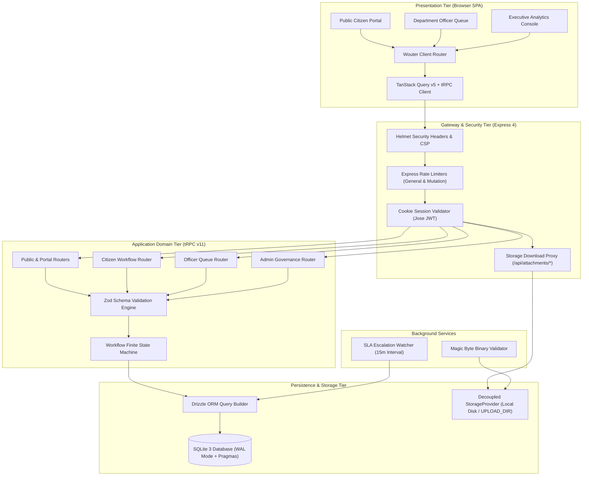

---

## 🔄 Grievance Lifecycle & SLA Engine

Grievance statuses transition through a deterministic finite-state machine (FSM). Unauthorized or invalid transitions (such as jumping from `submitted` directly to `resolved` without assignment) are rejected at the API boundary with descriptive validation messages.

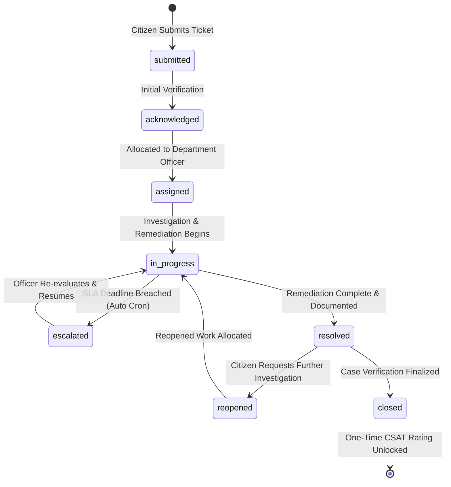

### State Transition Authority Matrix

| Source State | Permitted Next States | Authorized Roles | Business Requirement |
| :--- | :--- | :--- | :--- |
| `submitted` | `acknowledged` | Administrator | Initial docket review and triage. |
| `acknowledged` | `assigned` | Administrator, Officer | Allocated to specific department officer. |
| `assigned` | `in_progress` | Assigned Officer, Admin | Officer accepts and begins work on docket. |
| `in_progress` | `escalated`, `resolved` | Assigned Officer, Admin, SLA Cron | Requires resolution notes if resolving. |
| `escalated` | `in_progress` | Assigned Officer, Admin | Case reassessed and moved back to active work. |
| `resolved` | `closed`, `reopened` | Citizen (reopen), Staff (close) | Reopening requires explanatory remarks. |
| `reopened` | `in_progress` | Assigned Officer, Admin | Case reopened for secondary remediation. |
| `closed` | *Terminal State* | System / Read-Only | CSAT feedback review becomes available. |

---

## 🔒 Security Architecture & Hardening Specifications

Following the comprehensive Phase 29 audit and release freeze protocol, CivicResolve features enterprise-grade security defaults:

### 1. Server-Side Public DTO Shaping (Privacy Shield)
- Public endpoints (`public.board`, `public.suggestions`, `portal.detail`) enforce explicit DTO response projection.
- Citizen contact emails are dynamically masked (`c***@example.com`).
- Internal citizen records (`user`), officer identities (`assignedOfficer`), and residential street coordinates are completely stripped from public responses.
- Timeline history sanitizes actor identities, rendering generic titles like *"Assigned Officer"* or *"Citizen"* to prevent staff harassment.

### 2. Credential Privacy
- Password hashes (`passwordHash`) are strictly excluded from `auth.me`, `admin.users`, and `admin.officers` procedures, ensuring credentials never touch browser memory or `localStorage`.

### 3. Decoupled Storage & Attachment Proxy
- Decoupled from external Forge API dependencies in favor of a pluggable `StorageProvider` abstraction.
- Zero-dependency `LocalStorageProvider` incorporates strict directory traversal guards (`path.resolve` containment checks).
- File uploads undergo binary magic byte verification (PDF `%PDF`, JPEG `FF D8 FF`, PNG `89 50 4E 47`, WebP `RIFF...WEBP`).
- Download access via `GET /api/attachments/:key` is guarded: users must either possess an authenticated session (with case ownership or departmental assignment) or present the valid tracking docket parameter (`?trackingNumber=...`).

### 4. Database Concurrency & Referential Integrity
- `PRAGMA foreign_keys = ON;` is enforced on every database connection.
- Write-Ahead Logging (`PRAGMA journal_mode = WAL;`) and `PRAGMA busy_timeout = 5000;` prevent lock contention under concurrent load.
- Multi-step mutations are wrapped in atomic Drizzle transactions.
- Ticket serial numbers query the maximum annual sequence with exponential jitter retry logic to prevent duplicate tracking numbers during simultaneous submissions.

### 5. Network Hardening & Rate Limiting
- `helmet` enforces Content Security Policy (CSP), `X-Content-Type-Options: nosniff`, and `X-Frame-Options: SAMEORIGIN`.
- `express-rate-limit` enforces 300 requests per 15 minutes on general `/api/` traffic and 25 requests per 15 minutes on sensitive public mutations (`portal.create`, `portal.uploadAttachment`, `portal.feedback`).

---

## 🛠️ Technology Stack Breakdown

| Architectural Layer | Technology | Version | Engineering Role |
| :--- | :--- | :--- | :--- |
| **Frontend Framework** | React | `^19.2.1` | Concurrent rendering, declarative component state. |
| **Type System** | TypeScript | `^5.9.3` | Strict type checking across client and server. |
| **Styling & Tokens** | Tailwind CSS | `^4.1.14` | High-performance CSS engine with bespoke editorial design tokens. |
| **UI Primitives** | Radix UI | Latest | Unstyled, accessible UI components (Dialog, Tabs, Accordion, Tooltip). |
| **Client Routing** | Wouter | `^3.3.5` | Minimalist (<2KB), performant SPA routing. |
| **API Transport** | tRPC | `^11.6.0` | End-to-end type safety with zero code generation overhead. |
| **Backend Runtime** | Node.js + Express | `v20+` / `4.21` | High-throughput ESM HTTP server. |
| **Database & ORM** | Drizzle ORM + LibSQL / SQLite | `^0.44.5` | Type-safe SQL builder with zero runtime overhead. |
| **Session & Auth** | Jose | `^6.1.0` | Secure JWT creation, signing, and verification. |
| **Data Validation** | Zod | `^4.1.12` | Runtime schema validation for all API inputs. |
| **Security Tooling** | Helmet + Express Rate Limit | `^8.0` / `^7.5` | HTTP security headers and rate limiting. |
| **Test Framework** | Vitest + Testing Library | `^2.1.4` | Fast unit and integration testing suite. |

---

## 🎓 Submission Demo Path & Viva Guide

### Verified Local Demo Accounts

The project includes an automated idempotent seeding script providing test accounts across all roles:

| Role | Email | Password | Assigned Department / Scope |
| :--- | :--- | :--- | :--- |
| **Administrator** | `admin@civicresolve.internal` | `Admin@CivicResolve2026!` | Global System Oversight & Analytics |
| **Officer** | `officer.works@civicresolve.internal` | `Officer@CivicResolve2026!` | Public Works (ID: 1) |
| **Officer** | `officer.water@civicresolve.internal` | `Officer@CivicResolve2026!` | Water and Sanitation (ID: 2) |
| **Officer** | `officer.community@civicresolve.internal` | `Officer@CivicResolve2026!` | Community Services (ID: 3) |

---

### Step-by-Step Viva Presentation Script (5-Minute Walkthrough)

```
1. PUBLIC FILING (Citizen Perspective)
   Navigate to /cases/new
   • Fill out Title: "Broken Streetlight on Campus Main Boulevard"
   • Select Department: "Public Works" | Category: "Street Lighting"
   • Attach sample evidence (PDF or JPG image)
   • Click Submit -> Copy generated tracking number (e.g., GRV-2026-00001)

2. REAL-TIME TRACKING (Transparency Check)
   Navigate to /track
   • Paste tracking number: GRV-2026-00001
   • Notice complainant email is masked (e.g., c***@university.edu)
   • Observe SLA Target Date and initial "Submitted" milestone
   • Download the attached evidence document to verify secure proxy

3. OFFICER TRIAGE & WORKFLOW (Operations Perspective)
   Navigate to /staff/login
   • Sign in as: officer.works@civicresolve.internal / Officer@CivicResolve2026!
   • View assigned queue on /manage
   • Open ticket -> Advance status: Submitted -> Acknowledged -> In Progress
   • Add progress remark: "Dispatching maintenance team to inspect wiring"

4. CASE RESOLUTION & CITIZEN CSAT (Closing the Loop)
   • Mark case as "Resolved" with resolution note: "Replaced photocell and bulb"
   • Switch back to /track/GRV-2026-00001
   • Observe real-time "Resolved" state
   • Submit citizen CSAT feedback rating (5 stars + review comment)

5. EXECUTIVE GOVERNANCE & TELEMETRY (Leadership Perspective)
   Navigate to /staff/login
   • Sign in as: admin@civicresolve.internal / Admin@CivicResolve2026!
   • Open /admin to inspect MTTR metrics, department caseloads, and SLA compliance
```

---

### Academic Viva Questions & Answers

<details>
<summary><strong>Q1: Why choose tRPC over traditional REST or GraphQL?</strong></summary>
<br/>
<em>Answer:</em> tRPC enables direct TypeScript type sharing between backend procedures and frontend React components without requiring intermediate code generation or schema compilation. If a backend database column or validation rule changes, compile-time errors immediately flag affected UI components. This eliminates schema drift, guarantees autocompletion, and reduces payload size compared to GraphQL.
</details>

<details>
<summary><strong>Q2: How does CivicResolve guarantee data integrity during status updates?</strong></summary>
<br/>
<em>Answer:</em> State transitions pass through a centralized finite state machine (<code>assertWorkflowTransition</code>). The server strictly verifies that the proposed transition is legally permissible from the ticket's current status and confirms the actor holds the required role (e.g., only assigned officers or admins can move a ticket to <code>in_progress</code>; citizens can only perform <code>reopened</code>). All related mutations (status update, timeline event creation, attachment linking) are executed inside atomic database transactions.
</details>

<details>
<summary><strong>Q3: How is citizen privacy preserved without requiring a citizen login?</strong></summary>
<br/>
<em>Answer:</em> The platform uses public DTO response shaping. Even though internal database records hold contact emails and residential coordinates, public queries (<code>public.board</code>, <code>public.suggestions</code>, <code>portal.detail</code>) explicitly omit or mask this information before serialization. Citizens look up cases via their unguessable sequential tracking tokens.
</details>

<details>
<summary><strong>Q4: How does the system prevent SQLite concurrency bottlenecks?</strong></summary>
<br/>
<em>Answer:</em> CivicResolve configures SQLite with Write-Ahead Logging (<code>PRAGMA journal_mode = WAL;</code>), allowing concurrent reads to execute simultaneously without blocking ongoing writes. We also set <code>PRAGMA busy_timeout = 5000;</code> so transient write contentions wait up to 5 seconds rather than throwing immediate locks. Sequence numbers query maximum annual serial values with exponential jitter retry logic to handle concurrent insertions gracefully.
</details>

<details>
<summary><strong>Q5: How does the file storage layer defend against malicious uploads?</strong></summary>
<br/>
<em>Answer:</em> Every file upload passes through a 3-layer security check: (1) Extension whitelisting, (2) 2 MB payload ceiling, and (3) Binary magic byte buffer inspection that verifies actual file headers (e.g., verifying <code>%PDF</code> for PDFs or <code>FF D8 FF</code> for JPEGs) to prevent executable renaming attacks. Files are stored with sanitized names via a path-traversal-resistant storage provider and served through an authorized proxy.
</details>

<details>
<summary><strong>Q6: How does automated SLA escalation work in the background?</strong></summary>
<br/>
<em>Answer:</em> When a ticket is created, an exact due date is calculated in UTC based on the department's configured SLA hours. A background cron watcher runs every 15 minutes to query open, unescalated tickets past their due date, automatically elevating their priority to <code>critical</code> and appending an automated escalation record to the audit timeline.
</details>

---

## ⚡ Quick Start & Installation

### Prerequisites
- **Node.js**: `v20.0.0` or higher
- **pnpm**: `v9.0.0` or higher (recommended)

### 1. Clone the Repository
```bash
git clone https://github.com/sachin-saroj/CivicResolve.git
cd CivicResolve
```

### 2. Install Dependencies
```bash
pnpm install
```

### 3. Configure Environment Variables
Copy the template configuration:
```bash
cp .env.example .env
```

The system runs out of the box with zero external infrastructure dependencies using an embedded SQLite database (`local.db`):
```env
NODE_ENV=development
PORT=3000
HOST=0.0.0.0
DATABASE_URL=file:./local.db
JWT_SECRET=use-a-secure-random-key-at-least-32-characters-long
SESSION_SECRET=use-a-secure-random-key-at-least-32-characters-long
UPLOAD_DIR=./uploads
```

### 4. Seed Local Demo Accounts
Initialize the database catalog, departments, administrator account, and sample departmental officers:
```bash
pnpm run seed:admin
```

### 5. Start Development Server
```bash
pnpm run dev
```
Open [http://localhost:3000](http://localhost:3000) in your browser.

---

## 🐳 Docker & Containerized Deployment

CivicResolve is packaged with a multi-stage production [`Dockerfile`](Dockerfile) and [`docker-compose.yml`](docker-compose.yml) configured for single-instance persistent volume storage.

### Deploy with Docker Compose
```bash
# Build and run container in detached mode
docker compose up -d --build

# Verify container status and health probe
docker compose ps
curl http://localhost:3000/health
```

### Docker Volume Persistence
The container mounts persistent volumes for:
- `/data`: Houses the persistent SQLite database file (`civicresolve.db`, `*.db-wal`, `*.db-shm`).
- `/uploads`: Stores verified evidence attachments across container restarts.

---

## 🧪 Verification & Quality Benchmarks

CivicResolve enforces a strict quality gate before any release.

```bash
# Run automated test suite (61 tests across 14 test files)
pnpm test

# Run TypeScript static analysis
pnpm run check

# Run production bundle compilation
pnpm run build
```

### Verified Test Suite Summary (61/61 Passing)
- `server/security.hardening.test.ts` — Public PII masking, magic byte validation, path traversal defense, foreign key verification, concurrent sequence numbers, credential privacy, and attachment download authorization.
- `server/public.portal.test.ts` — Login-free grievance creation, anonymous tracking, and DTO shape validation.
- `server/workflow.test.ts` — Finite state machine transitions, citizen reopen boundaries, and role guards.
- `server/internalAuth.test.ts` — Password hashing, credential verification, and JWT session handling.
- `server/officer.queue.test.ts` — Queue filtering, pagination, and departmental assignment verification.
- `server/staff.scope.test.ts` — Cross-department read/write isolation.
- `server/sla.test.ts` — Dynamic deadline computation and escalation rules.
- `server/catalog.integration.test.ts` — Departmental taxonomy and catalog initialization.
- `server/civic-enhancements.test.ts` — Civic enhancements and search logic.
- `server/auth.logout.test.ts` — Secure multi-cookie revocation.
- `server/public.workflow.feedback.test.ts` — Feedback submission and constraint enforcement.
- `client/src/pages/GrievanceDetail.test.tsx` — UI workflow mutations and timeline rendering.
- `client/src/pages/Phase2Analytics.test.tsx` — Executive analytics telemetry and SLA charts.

---

## 🗺️ Complete API & Route Reference

### Frontend Route Map

| URL Route | Interface | Access Scope | Description |
| :--- | :--- | :--- | :--- |
| `/` | Public Home & Manifesto | Public | Editorial landing, Fast Docket Lookup, civic metrics, service folders. |
| `/cases/new` | Grievance Filing | Public | 3-step submission form with category routing and evidence upload. |
| `/track` | Tracking Gateway | Public | Search portal for public tracking tokens. |
| `/track/:trackingNumber` | Public Docket Tracker | Public | Real-time milestone tracker, masked details, and CSAT feedback. |
| `/staff/login` | Staff Gateway | Public | Credential authentication portal for officers and administrators. |
| `/manage` | Operations Workspace | Officer / Admin | Filterable, sortable Kanban queue with bulk triage operations. |
| `/officer/cases/:trackingNumber` | Internal Case Management | Officer / Admin | Case investigation view, progress event logging, and status transitions. |
| `/admin` | Executive Telemetry | Administrator | Global metrics, SLA compliance heatmaps, and department volume. |
| `/admin/departments` | Department Registry | Administrator | Configure active departments and SLA resolution hours. |
| `/admin/categories` | Category Taxonomy | Administrator | Manage hierarchical grievance categories and department mappings. |

---

### Backend tRPC API Routers

| Router | Procedure | Type | Access Level | Description |
| :--- | :--- | :--- | :--- | :--- |
| `auth` | `me` | Query | Public | Returns authenticated user info (strictly omitting `passwordHash`). |
| `auth` | `internalLogin`| Mutation| Public (Throttled) | Validates email/password and sets secure HTTP-only JWT cookie. |
| `auth` | `logout` | Mutation| Public | Revokes session and clears authentication cookies. |
| `public` | `catalog` | Query | Public | Returns active departments and available grievance categories. |
| `public` | `board` | Query | Public | Returns sanitized public grievances (PII and residential location stripped). |
| `public` | `suggestions` | Query | Public | Fast autocomplete suggestions (omitting location and email data). |
| `public` | `lookup` | Query | Public | Fast status lookup for tracking tokens. |
| `portal` | `create` | Mutation| Public (Throttled) | Files a public grievance under the public service actor. |
| `portal` | `detail` | Query | Public | Returns sanitized case DTO with masked email and authorized attachment URLs. |
| `portal` | `uploadAttachment`| Mutation| Public (Throttled)| Uploads evidence document with magic byte buffer validation. |
| `portal` | `feedback` | Mutation| Public (Throttled)| Submits post-resolution 1-5 star CSAT feedback review. |
| `citizen` | `dashboard` | Query | Citizen (`user`) | Returns user's filed grievances and status distribution. |
| `citizen` | `reopen` | Mutation| Citizen (`user`) | Reopens a resolved case with mandatory explanation. |
| `officer` | `queue` | Query | Officer / Admin | Department-scoped case queue with filtering and sorting. |
| `officer` | `updateCase` | Mutation| Officer / Admin | Advances grievance workflow status with FSM transition verification. |
| `officer` | `addProgress`| Mutation| Officer / Admin | Appends progress notes or actions taken to case history. |
| `officer` | `bulkUpdate` | Mutation| Officer / Admin | Batch-updates priority or status for multiple assigned cases. |
| `admin` | `dashboard` | Query | Admin Only | Aggregated system metrics, MTTR, and SLA breach heatmaps. |
| `admin` | `assign` | Mutation| Admin Only | Allocates a grievance to a designated departmental officer. |
| `admin` | `createDepartment`| Mutation| Admin Only | Adds a new department with custom SLA turnaround hours. |
| `admin` | `createCategory`| Mutation| Admin Only | Creates a grievance category linked to a department. |

---

## 📂 Project Directory Structure

```
├── client/                     # Frontend Application (React 19 SPA)
│   ├── src/
│   │   ├── _core/              # Authentication hooks & utilities
│   │   ├── components/         # Reusable UI primitives & editorial layouts
│   │   ├── contexts/           # Theme (light/dark) and state providers
│   │   ├── hooks/              # Custom React application hooks
│   │   ├── pages/              # Route pages (Landing, Tracker, Manage, Admin)
│   │   ├── App.tsx             # Main router & provider orchestration
│   │   └── index.css           # Tailwind v4 configuration & editorial tokens
│   └── index.html              # HTML shell & font preloading
├── drizzle/                    # Database Architecture
│   ├── schema.ts               # Drizzle table definitions, relations & indexes
│   └── migrations/             # SQL migration files
├── server/                     # Backend Application (Node.js + Express + tRPC)
│   ├── _core/                  # Express configuration, security headers & context
│   │   ├── index.ts            # Server entrypoint, rate limiters, health routes
│   │   ├── storageProxy.ts     # Authorized attachment download proxy
│   │   └── sdk.ts              # Authentication & session token utilities
│   ├── db.ts                   # SQLite connection, pragmas, transactions & queries
│   ├── internalAuth.ts         # Scrypt password hashing & JWT management
│   ├── routers.ts              # tRPC API route handlers & procedure guards
│   ├── seed-admin.ts           # Admin & officer account initialization script
│   ├── storage.ts              # Storage facade adapter
│   ├── storageProvider.ts      # LocalStorageProvider with path traversal defense
│   ├── workflow.ts             # Grievance finite state machine (FSM)
│   └── *.test.ts               # Automated Vitest unit & integration test suites
├── docs/                       # Project Documentation & Verification Records
│   ├── FINAL-PRODUCTION-READINESS-REPORT.md
│   ├── PRODUCTION-DEPLOYMENT-REQUIREMENTS.md
│   ├── PHASE-29-SECURITY-HARDENING-REPORT.md
│   └── screenshots/            # Authentic interface captures
├── Dockerfile                  # Multi-stage production container build
├── docker-compose.yml          # Containerized deployment with volume persistence
├── .env.example                # Environment configuration template
├── package.json                # Project dependencies & scripts
├── tsconfig.json               # TypeScript strict configuration
└── vite.config.ts              # Vite bundler configuration
```

---

## 📄 License & Attribution

This project is licensed under the **MIT License**. Created with dedication for academic excellence and civic engineering.

**Author:** [Sachin Saroj](https://github.com/sachin-saroj)  
**Repository:** [https://github.com/sachin-saroj/CivicResolve](https://github.com/sachin-saroj/CivicResolve)
